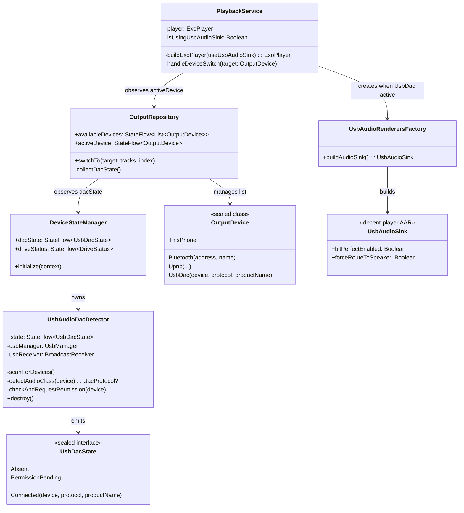
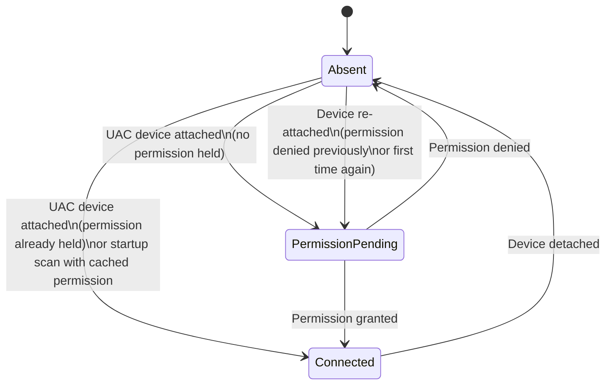
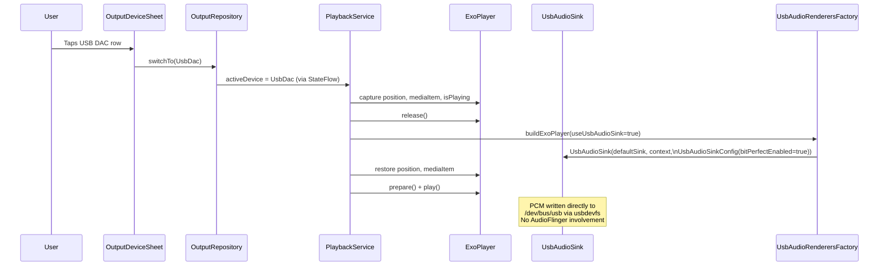
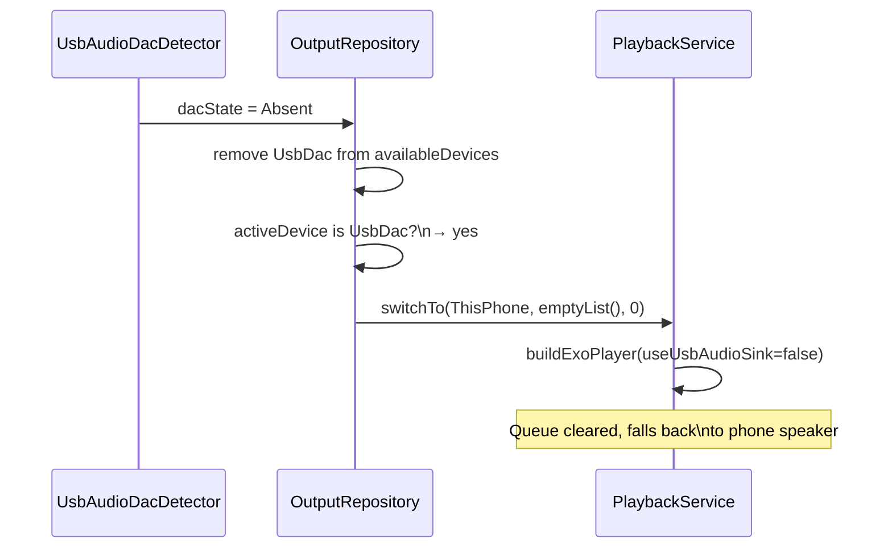

# USB DAC Bit-Perfect Playback

**Module:** `:app` — `com.bitperfect.app.usb`, `com.bitperfect.app.output`, `com.bitperfect.app.player`  
**Status:** Implemented  
**Library:** [decent-player v0.1.0](https://github.com/Ma145/decent-player/releases/tag/v0.1.0-libs)

---

## Overview

When a USB Audio Class (UAC) DAC is connected to the phone via USB-C, BitPerfect routes audio directly to the device using the [decent-player](https://github.com/Ma145/decent-player) userspace USB audio driver. This bypasses Android's AudioFlinger mixer entirely — no resampling, no float conversion, no system volume in the signal path. CD FLAC files (16-bit / 44.1 kHz) are delivered to the DAC exactly as they were ripped.

### Why this matters

Android's audio stack resamples all output to the device's primary sample rate, which is almost always 48 kHz. For CD audio at 44.1 kHz this means a 44.1 → 48 kHz conversion on every playback. The decent-player library writes isochronous USB transfers directly to `/dev/bus/usb` via Linux `usbdevfs`, skipping the entire AudioFlinger → HAL chain.

### What "bit-perfect" means in this context

- PCM data from the FLAC decoder reaches the DAC unmodified
- No volume scaling (hardware volume on the DAC is the only control)
- No audio effects, EQ, or mixing
- The FiiO KA11's LED will show **blue** (≤48 kHz) when receiving 44.1 kHz — confirming the resampler was bypassed

### Supported devices

Any USB Audio Class 2.0 (UAC2) device. UAC1 devices are detected but not currently guaranteed to work with decent-player's isochronous path. Dedicated audiophile DAC dongles (FiiO KA11, iFi Go Bar, Cayin RU7, etc.) are the intended target. Consumer USB audio devices (Bluetooth speakers in wired mode, headsets, game controllers) may advertise UAC2 but are not designed for this path — a confirmation dialog will be added in a future phase to let users opt in explicitly.

---

## Architecture



---

## Detection Flow

`UsbAudioDacDetector` registers a `BroadcastReceiver` for three intents:

- `UsbManager.ACTION_USB_DEVICE_ATTACHED`
- `UsbManager.ACTION_USB_DEVICE_DETACHED`
- `com.bitperfect.USB_DAC_PERMISSION`

On attach (and on startup scan), each device is passed through `detectAudioClass()`. This iterates the device's USB interfaces looking for:

| Field | UAC2 | UAC1 |
|---|---|---|
| `interfaceClass` | `0x01` (USB_CLASS_AUDIO) | `0x01` |
| `interfaceSubclass` | `0x02` (AudioStreaming) | `0x02` |
| `interfaceProtocol` | `0x20` | `0x00` |

UAC2 takes priority if both are found on the same device. Non-audio devices (mass storage CD drives, etc.) return `null` and are ignored — the drive detector and DAC detector are completely independent.



---

## Playback Switch Flow

When `OutputRepository` observes a `UsbDacState.Connected` emission, it adds an `OutputDevice.UsbDac` entry to `availableDevices`. When the user selects it, `switchTo()` is called and `PlaybackService.handleDeviceSwitch()` receives the new target.



### Switching back to local output

When the user selects `ThisPhone` or `Bluetooth` while `isUsingUsbAudioSink = true`, `PlaybackService` performs the same rebuild in reverse: captures state, releases the player (which releases `UsbAudioSink` via the `ForwardingAudioSink` chain), rebuilds with `DefaultRenderersFactory`, and restores playback state.

---

## DAC Detach While Active

If the DAC is unplugged during playback, `UsbAudioDacDetector` emits `UsbDacState.Absent`. `OutputRepository`'s `dacState` collector detects that the active device is a `UsbDac` and calls `switchTo(ThisPhone, emptyList(), 0)`, triggering a player rebuild to `DefaultAudioSink`. Playback falls back to the phone speaker within one collection cycle.



---

## Permission Handling

On first connection, Android requires the user to grant permission before the app can open the USB device node. `UsbAudioDacDetector` requests this via `UsbManager.requestPermission()` and emits `PermissionPending` while waiting. The `OutputDeviceSheet` shows a greyed, non-tappable row during this state.

```
┌─────────────────────────────────────┐
│  📱  This Phone                     │  ← always shown
│  🔵  Living Room (WiiM)             │  ← when discovered
│  🔌  USB DAC  ·  Waiting for        │  ← PermissionPending
│      permission…                    │
└─────────────────────────────────────┘
```

Once permission is granted (cached by Android for subsequent connections), the row becomes active and selectable. If permission is denied, the row disappears. Re-plugging the device triggers a fresh permission request.

---

## Key Files

| File | Role |
|---|---|
| `usb/UsbDacState.kt` | Sealed state: `Absent`, `PermissionPending`, `Connected` |
| `usb/UsbAudioDacDetector.kt` | BroadcastReceiver, UAC detection, permission lifecycle |
| `usb/DeviceStateManager.kt` | Singleton owning both `UsbDriveDetector` and `UsbAudioDacDetector` |
| `output/OutputDevice.kt` | `OutputDevice.UsbDac` subtype with `deviceId`-based equality |
| `output/OutputRepository.kt` | `dacState` collector, `availableDevices` management, detach fallback |
| `player/UsbAudioRenderersFactory.kt` | `DefaultRenderersFactory` override injecting `UsbAudioSink` |
| `player/PlaybackService.kt` | `buildExoPlayer()`, `handleDeviceSwitch()`, `isUsingUsbAudioSink` flag |
| `ui/AppViewModel.kt` | Exposes `dacState` and `trackFormatInfo` ("BIT-PERFECT · 44.1 kHz · 16-bit") |
| `ui/OutputDeviceSheet.kt` | `PermissionPending` row, `UsbDac` row with USB icon |
| `ui/NowPlayingScreen.kt` | Bit-perfect badge via existing `trackFormatInfo` component |
| `ui/NowPlayingBar.kt` | "BIT-PERFECT" label below artist name when `UsbDac` active |

---

## decent-player Library

Two AARs in `app/libs/`:

- `decent-usb-audio-driver-0.1.0.aar` — native C++/JNI UAC2 driver writing isochronous URBs to `usbdevfs`
- `decent-usb-audio-wrapper-media3-0.1.0.aar` — `UsbAudioSink` as a `ForwardingAudioSink` for Media3/ExoPlayer

`UsbAudioSink` is constructed wrapping a `DefaultAudioSink` with `UsbAudioSinkConfig(bitPerfectEnabled = true, forceRouteToSpeaker = false)`. The wrapped `DefaultAudioSink` handles format negotiation and error delegation; the outer sink intercepts the PCM write path and redirects to the USB device via isochronous transfers.

The library detects the connected USB audio device internally via `UsbManager` — `UsbAudioRenderersFactory` does not need to pass a `UsbDevice` reference to the sink.

---

## Known Limitations

- **No volume control.** Bit-perfect output means no volume scaling in software. Hardware volume on the DAC is the only control. The volume slider is hidden in `OutputDeviceSheet` when `UsbDac` is active.
- **One DAC at a time.** `UsbAudioSink` is a singleton within the library; only one USB audio device can be active.
- **Consumer USB audio devices.** Devices that advertise UAC2 but are not dedicated DACs (e.g. Bluetooth speakers connected via USB-C) will be detected and offered as bit-perfect targets but may produce silence. A user opt-in confirmation dialog is planned for a future phase.
- **Queue lost on detach fallback.** When the DAC is unplugged mid-playback, the track queue is cleared as part of the `ThisPhone` fallback. This is a known trade-off of the current architecture.
- **decent-player v0.1.0 is early.** Tested on a small number of devices. If `UsbAudioSink` produces silence on a specific DAC, the fallback is to deselect it in the speaker-connect sheet — Android's normal USB audio path will then handle the device.
- 
