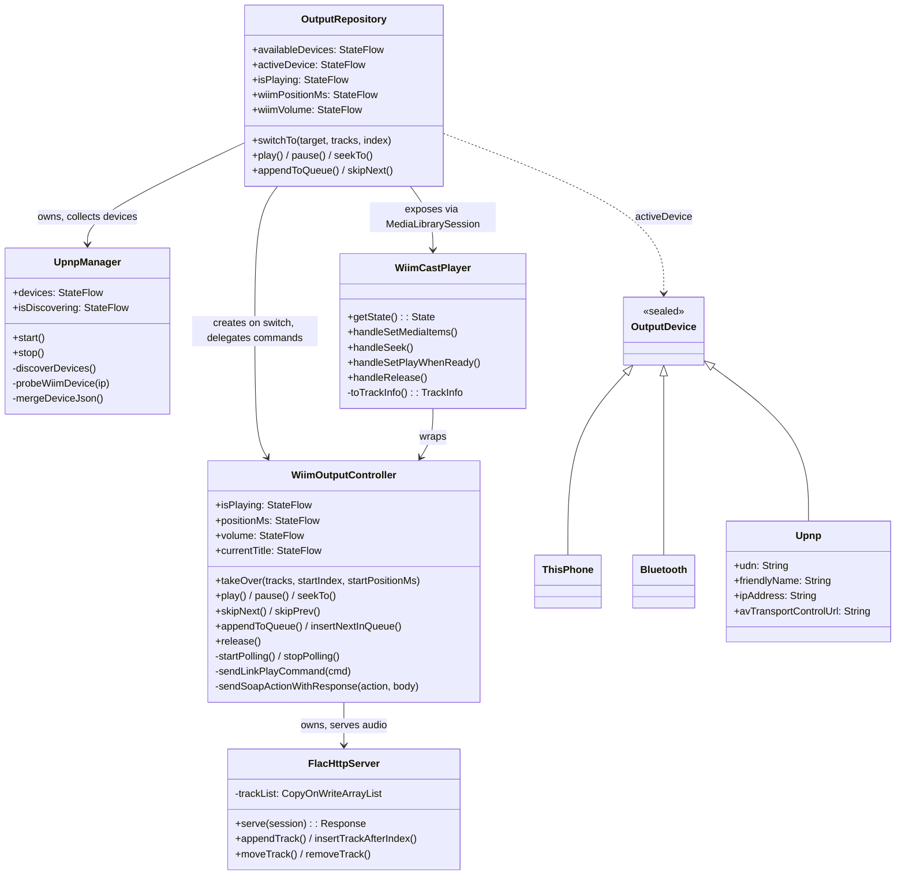
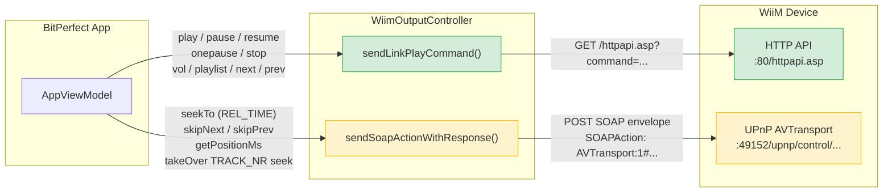
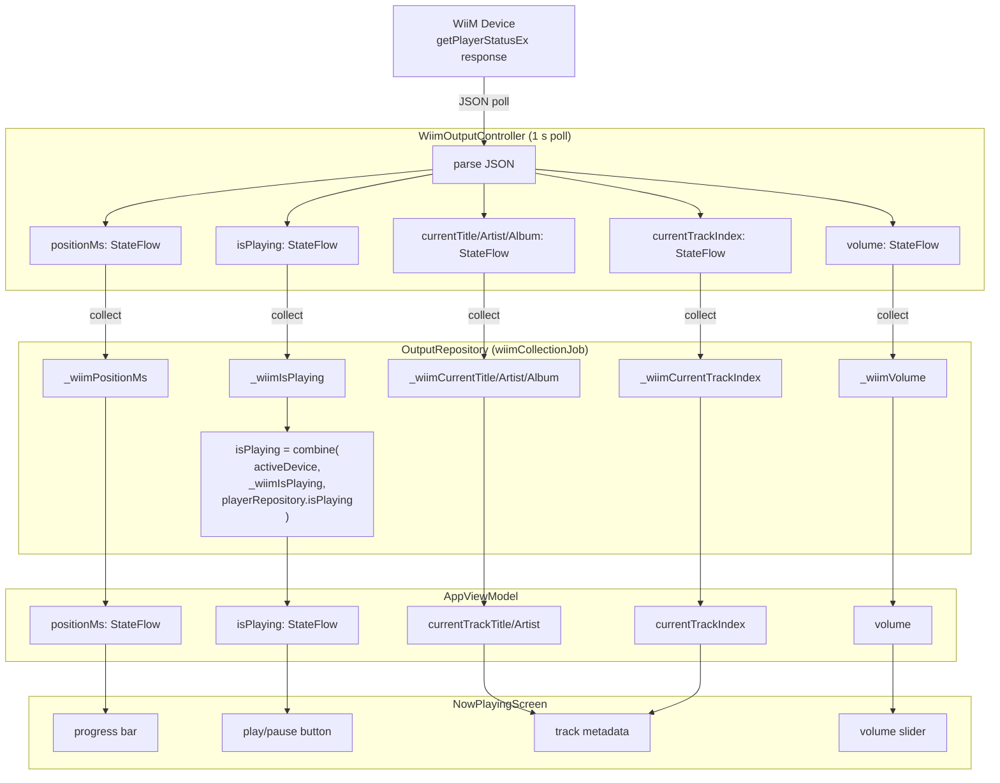
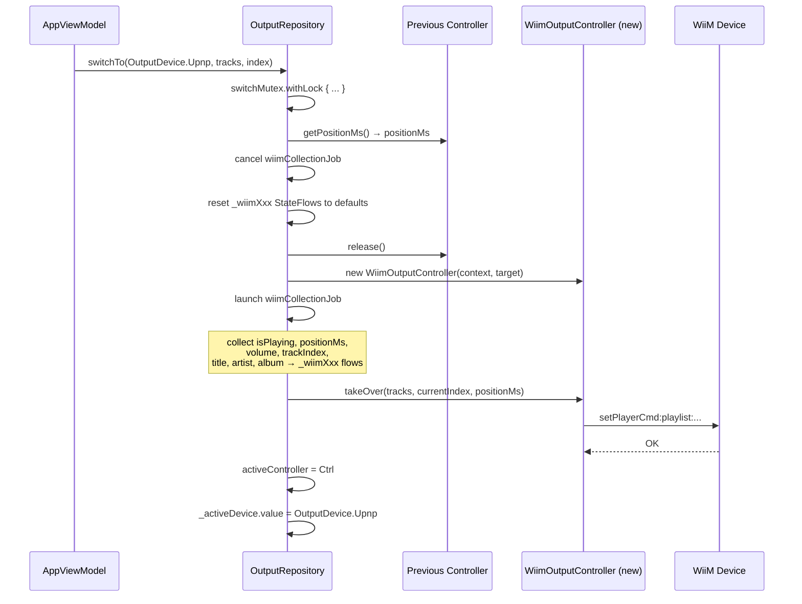

# WiiM Speaker Integration

**Module:** `:app` — `com.bitperfect.app.output`  
**Status:** Implemented

---

## Overview

BitPerfect streams audio to WiiM (and compatible LinkPlay) network speakers over Wi-Fi. The integration is built on two protocols running in parallel:

- **LinkPlay HTTP API** — a proprietary REST-like API exposed on port 80 (or 443/4443) of every WiiM device. Used for playback commands (play, pause, seek, volume) and polling playback state.
- **UPnP AVTransport 1.0** — standard SOAP/XML service on port 49152. Used for track navigation (Next, Previous) and position queries.

Audio delivery uses a lightweight HTTP server embedded in the app that serves FLAC files and an M3U8 playlist directly to the device.

---

## Architecture



### Key classes

| Class | File | Role |
|---|---|---|
| `UpnpManager` | `UpnpManager.kt` | SSDP multicast discovery, LinkPlay device probing |
| `OutputDevice.Upnp` | `OutputDevice.kt` | Immutable data class holding device identity and endpoint URLs |
| `WiimOutputController` | `WiimOutputController.kt` | Implements `OutputController`; owns `FlacHttpServer` and the polling coroutine |
| `WiimCastPlayer` | `WiimCastPlayer.kt` | `SimpleBasePlayer` wrapper exposing `WiimOutputController` to `MediaLibrarySession` |
| `OutputRepository` | `OutputRepository.kt` | Orchestrates device switching; collects WiiM state flows and exposes them to the ViewModel |

---

## Phase 1 — Discovery (`UpnpManager`)

### SSDP M-SEARCH

Discovery is triggered by `UpnpManager.start()` and runs once for up to 5 seconds. The manager:

1. Acquires a `WifiManager.MulticastLock` so Android does not suppress multicast packets.
2. Opens a `MulticastSocket` and joins the SSDP multicast group (`239.255.255.250:1900`) on the Wi-Fi interface.
3. Sends one M-SEARCH datagram searching for `urn:schemas-upnp-org:device:MediaRenderer:1`.
4. Listens for HTTP/1.1 responses until the socket times out (5 s) or the 5-second deadline elapses.

```
M-SEARCH * HTTP/1.1
HOST: 239.255.255.250:1900
MAN: "ssdp:discover"
MX: 3
ST: urn:schemas-upnp-org:device:MediaRenderer:1
```

Each unique IP extracted from a `LOCATION` header is probed exactly once. Duplicate IPs are deduplicated with a `foundIps` set.

```mermaid
sequenceDiagram
    participant App as UpnpManager
    participant Net as LAN (multicast)
    participant WiiM as WiiM Device

    App->>App: acquire MulticastLock
    App->>App: join 239.255.255.250:1900 on Wi-Fi interface
    App->>Net: M-SEARCH * HTTP/1.1<br/>ST: urn:schemas-upnp-org:device:MediaRenderer:1
    WiiM-->>App: HTTP/1.1 200 OK<br/>LOCATION: http://&lt;ip&gt;:49152/description.xml

    Note over App: extract IP from LOCATION header
    Note over App: skip if already seen

    App->>WiiM: GET https://&lt;ip&gt;:443/httpapi.asp?command=getPlayerStatusEx
    alt HTTPS 443 responds
        WiiM-->>App: JSON {status, vol, Title, ...}
    else try HTTPS 4443
        App->>WiiM: GET https://&lt;ip&gt;:4443/httpapi.asp?command=getPlayerStatusEx
        WiiM-->>App: JSON {status, vol, Title, ...}
    else fallback HTTP 80
        App->>WiiM: GET http://&lt;ip&gt;/httpapi.asp?command=getPlayerStatusEx
        WiiM-->>App: JSON {status, vol, Title, ...}
    end

    App->>WiiM: GET &lt;baseUrl&gt;/httpapi.asp?command=getStatusEx
    WiiM-->>App: JSON {DeviceName, uuid, hardware, ...}

    App->>App: mergeDeviceJson()<br/>→ OutputDevice.Upnp(friendlyName, udn, ipAddress, ...)
    App->>App: emit to devices: StateFlow
    App->>App: release MulticastLock
```

> **Reference comparison — SSDP pre-filtering:** pywiim adds an extra pre-filter step before probing: it checks the SSDP `SERVER` and `ST` headers against known non-LinkPlay patterns (Sonos, Chromecast, Samsung, Roku, etc.) and skips those devices outright, saving probe round-trips. It also maintains a list of known-LinkPlay `SERVER` patterns (`"WiiM"`, `"Linkplay"`) that allow skipping the API probe entirely. BitPerfect does no pre-filtering — every MediaRenderer response is probed. This is fine for a small home network but worth noting.

### LinkPlay probe (`probeWiimDevice`)

A plain UPnP MediaRenderer response is not sufficient — the manager verifies the device speaks LinkPlay by hitting two HTTP endpoints:

| Endpoint | Purpose |
|---|---|
| `GET /httpapi.asp?command=getPlayerStatusEx` | Confirms LinkPlay firmware; provides playback state |
| `GET /httpapi.asp?command=getStatusEx` | Provides device identity (name, UUID, hardware model) |

Three base URL schemes are tried in order: `https://<ip>:443`, `https://<ip>:4443`, `http://<ip>`. The first scheme to return a non-null JSON response wins.

> **Reference comparison — probe order:** pywiim uses the identical probe order (`https:443` → `https:4443` → `http:80`) and treats HTTPS on port 443 as the default connection for all subsequent API calls — not just during probing. pywiim also probes three endpoints in sequence (`getPlayerStatusEx` → `getStatusEx` → `getStatus`) and accepts any that returns a non-empty JSON object. BitPerfect probes both `getPlayerStatusEx` and `getStatusEx` in parallel and merges them; the outcome is equivalent.

### `mergeDeviceJson`

Merges the two JSON responses into an `OutputDevice.Upnp`:

- `DeviceName` / `device_name` → `friendlyName` (prefers `getStatusEx`)
- `uuid` → `udn` (falls back to raw IP if absent)
- `hardware` / `project` → `modelName` (from `getStatusEx` only)
- UPnP endpoint URLs are hard-coded based on the confirmed IP:
  - AVTransport control: `http://<ip>:49152/upnp/control/rendertransport1`
  - RenderingControl: `http://<ip>:49152/upnp/control/rendercontrol1`

Discovered devices are emitted via `UpnpManager.devices: StateFlow<List<OutputDevice.Upnp>>`. `OutputRepository` collects this and merges them into `availableDevices`.

---

## Phase 2 — Session handoff (`WiimOutputController.takeOver`)

When the user selects a WiiM device, `OutputRepository.switchTo()` creates a `WiimOutputController` and calls `takeOver(tracks, startIndex, startPositionMs)`.

### `takeOver` sequence

```mermaid
sequenceDiagram
    participant Repo as OutputRepository
    participant Ctrl as WiimOutputController
    participant Srv as FlacHttpServer (NanoHTTPD)
    participant WiiM as WiiM Device

    Repo->>Ctrl: takeOver(tracks, startIndex, startPositionMs)
    Ctrl->>Ctrl: getWifiIpAddress()
    Ctrl->>Srv: stop() previous server (if any)
    Ctrl->>Srv: new FlacHttpServer(context, tracks)
    Ctrl->>Srv: start(port=0)
    Srv-->>Ctrl: listeningPort = &lt;ephemeral&gt;

    Ctrl->>WiiM: GET /httpapi.asp?command=setPlayerCmd:playlist:&lt;encoded M3U8 url&gt;
    WiiM-->>Ctrl: OK
    Note over WiiM: fetches playlist.m3u8,<br/>begins playback from track 1

    WiiM->>Srv: GET /playlist.m3u8
    Srv-->>WiiM: #EXTM3U\n#EXTINF:...\nhttp://&lt;ip&gt;:&lt;port&gt;/track/&lt;id&gt;.flac\n...

    alt startIndex > 0
        Ctrl->>WiiM: SOAP Seek TRACK_NR Target=startIndex+1
        WiiM-->>Ctrl: OK
    end

    alt startPositionMs > 0
        Ctrl->>WiiM: SOAP Seek REL_TIME Target=HH:MM:SS
        Note right of Ctrl: ⚠ IMPROVEMENT-2/3:<br/>use setPlayerCmd:seek:&lt;s&gt; instead
        WiiM-->>Ctrl: OK
    end

    Ctrl->>Ctrl: startPolling()

    loop every 1 second
        Ctrl->>WiiM: GET /httpapi.asp?command=getPlayerStatusEx
        WiiM-->>Ctrl: JSON {status, curpos, vol, plicurr, Title, Artist, Album}
        Ctrl->>Ctrl: update StateFlows
    end
```

The `setPlayerCmd:playlist:` command causes the WiiM to fetch the M3U8, parse the track list, and begin playback from track 1 automatically. The subsequent `Seek TRACK_NR` jump is only issued for non-zero start indices.

> **Note:** `AVTransport:1` is used (not `:3`). WiiM devices advertise version 1 of the AVTransport service.

---

## Phase 3 — The embedded HTTP server (`FlacHttpServer`)

`FlacHttpServer` is a private inner class of `WiimOutputController` extending NanoHTTPD. It binds to a random port (passed `0` to NanoHTTPD) and serves three route patterns:

### Routes

| Path | Response |
|---|---|
| `GET /playlist.m3u8` | Dynamic M3U8 playlist reflecting current `trackList` |
| `GET /track/<id>.flac` | FLAC file bytes from `TrackInfo.filePath` or `dataPath` |
| `GET /art/<albumId>.jpg` | Album art from `MediaStore` content URI |

### M3U8 format

```
#EXTM3U
#EXTINF:<durationSeconds>,<artist> - <title>
http://<localIp>:<port>/track/<id>.flac
...
```

Duration in `#EXTINF` is in whole seconds (`durationMs / 1000`), or `-1` if unavailable.

### Range request support

The FLAC route handles `Range: bytes=N-M` headers, returning `206 Partial Content` with the appropriate `Content-Range` response header. This allows WiiM to seek within a track without re-downloading from the beginning.

### Thread-safe mutation

The internal `trackList` is a `CopyOnWriteArrayList`. Queue mutations (append, insert, move, remove) operate on this list, then re-issue `setPlayerCmd:playlist:` to the device so WiiM re-fetches the updated M3U8.

---

## Phase 4 — Playback control

### LinkPlay HTTP commands

Sent to `http://<ip>/httpapi.asp?command=<cmd>`:

| Operation | Command |
|---|---|
| Load playlist | `setPlayerCmd:playlist:<encoded-url>` |
| Resume | `setPlayerCmd:resume` |
| Pause | `setPlayerCmd:pause` |
| Toggle play/pause | `setPlayerCmd:onepause` |
| Stop | `setPlayerCmd:stop` |
| Set volume (0–100) | `setPlayerCmd:vol:<n>` |

> **Reference divergence — Next/Previous:** The pywiim reference library issues `setPlayerCmd:next` and `setPlayerCmd:prev` as LinkPlay HTTP commands for track navigation — it does not use UPnP SOAP for these operations at all. BitPerfect currently routes `skipNext()`/`skipPrev()` through UPnP `Next`/`Previous` SOAP actions. Both approaches work on WiiM firmware, but the LinkPlay HTTP path is simpler and does not depend on the AVTransport control URL being correctly discovered.

> **Reference divergence — Seek:** pywiim's `seek(position)` uses `setPlayerCmd:seek:<seconds>` (an integer number of seconds) as a LinkPlay HTTP command. BitPerfect converts the position to `HH:MM:SS` and sends it as a UPnP `Seek Unit=REL_TIME` SOAP action. Again both work, but the HTTP path avoids the SOAP overhead and the HH:MM:SS formatting.

### Protocol routing summary



> Green = LinkPlay HTTP (preferred path). Amber = UPnP SOAP (seek, next/prev are candidates for migration — see IMPROVEMENT-1/2/3).

### UPnP AVTransport SOAP actions

BitPerfect uses SOAP for operations that have no direct LinkPlay HTTP equivalent:

Sent to `http://<ip>:49152/upnp/control/rendertransport1` with `SOAPAction: "urn:schemas-upnp-org:service:AVTransport:1#<action>"`:

| Action | Purpose | Reference library equivalent |
|---|---|---|
| `Seek Unit=TRACK_NR Target=N` | Jump to track N (1-based) on initial `takeOver` | No direct equivalent — pywiim relies on playlist order |
| `Seek Unit=REL_TIME Target=HH:MM:SS` | Seek within current track | `setPlayerCmd:seek:<seconds>` (HTTP) |
| `Next` | Skip to next track | `setPlayerCmd:next` (HTTP) |
| `Previous` | Skip to previous track | `setPlayerCmd:prev` (HTTP) |
| `GetPositionInfo` | Query `RelTime` for current position | `curpos` field in `getPlayerStatusEx` poll |

---

## Phase 5 — State polling

`startPolling()` launches a coroutine that calls `getPlayerStatusEx` every 1 second and updates the following `StateFlow` properties:

| Field | JSON key | Type |
|---|---|---|
| `isPlaying` | `status` / `play_status` == `"play"` | `Boolean` |
| `positionMs` | `curpos` | `Long` |
| `volume` | `vol` (0–100) | `Int` |
| `currentTrackIndex` | `plicurr` | `Int` |
| `currentTitle` | `Title` (hex-encoded UTF-8) | `String?` |
| `currentArtist` | `Artist` (hex-encoded UTF-8) | `String?` |
| `currentAlbum` | `Album` (hex-encoded UTF-8) | `String?` |

Metadata fields (`Title`, `Artist`, `Album`) are hex-encoded UTF-8 strings in the LinkPlay API (e.g. `"54657374"` → `"Test"`). `decodeHexString()` decodes them.

> **Reference divergence — `curpos` units:** BitPerfect treats `curpos` unconditionally as milliseconds (`positionMs`). The pywiim reference confirms it is *usually* milliseconds, but streaming services (Spotify, AirPlay, etc.) can return it in **microseconds** instead. pywiim applies a sanity threshold: if the raw value would represent more than 10 hours when read as milliseconds, it divides by 1,000,000 instead of 1,000. BitPerfect is unaffected right now (it only plays local FLAC files), but this is worth noting if the integration is ever extended to network sources.

Polling errors (timeouts, network errors) are swallowed with a log warning; the loop continues.

`stopPolling()` cancels the job and resets `isPlaying` and `positionMs` to zero.

### State data flow



---

## Phase 6 — Media3 integration (`WiimCastPlayer`)

`WiimCastPlayer` extends `SimpleBasePlayer` (Media3 `@UnstableApi`) so that the existing `MediaLibrarySession` architecture continues to work when cast to a WiiM device.

### `getState()`

Builds a `State` from live `WiimOutputController` flows:

- `playlist` — reconstructed from `currentPlaylist` (the `List<MediaItem>` passed to `handleSetMediaItems`)
- `playWhenReady` — mirrors `controller.isPlaying`
- `contentPositionMs` — mirrors `controller.positionMs`
- `playbackState` — `STATE_IDLE` when playlist is empty, `STATE_READY` otherwise

`invalidateState()` is called whenever `isPlaying` or `positionMs` changes, causing Media3 to re-query `getState()` and push updates to connected controllers.

### `handleSetMediaItems`

Converts `List<MediaItem>` back to `List<TrackInfo>` via `MediaItem.toTrackInfo()`. Extra fields (`track_duration_ms`, `track_file_path`, `track_data_path`) are recovered from `mediaMetadata.extras`. Then calls `controller.takeOver(...)` on `Dispatchers.IO`.

### `MediaItem.toTrackInfo()` field mapping

| `TrackInfo` field | Source |
|---|---|
| `id` | `mediaId.toLongOrNull()` |
| `title` | `mediaMetadata.title` |
| `trackNumber` | `mediaMetadata.trackNumber` |
| `durationMs` | `extras["track_duration_ms"]` |
| `albumId` | last path segment of `mediaMetadata.artworkUri` |
| `albumTitle` | `mediaMetadata.albumTitle` |
| `artist` | `mediaMetadata.artist` |
| `filePath` | `extras["track_file_path"]` |
| `dataPath` | `extras["track_data_path"]` |

---

## Queue management

All queue mutations follow the same pattern:

1. Mutate `FlacHttpServer.trackList` (thread-safe via `CopyOnWriteArrayList`).
2. Re-issue `setPlayerCmd:playlist:<updated M3U8 URL>` to the device.

The WiiM re-fetches the M3U8 on each `setPlayerCmd:playlist:` call and rebuilds its internal queue. Because the URL is stable (same host, port, path — only the content changes), the device does not restart playback from scratch; it merges the new queue at the current position.

| `OutputController` method | `FlacHttpServer` mutation |
|---|---|
| `appendToQueue(track)` | `trackList.add(track)` |
| `appendAlbumToQueue(tracks)` | `trackList.addAll(tracks)` |
| `insertNextInQueue(track)` | `trackList.add(currentIndex + 1, track)` |
| `insertAlbumNextInQueue(tracks)` | `trackList.addAll(currentIndex + 1, tracks)` |
| `reorderQueue(from, to)` | `removeAt(from)`, `add(to, track)` |
| `removeFromQueue(index)` | `trackList.removeAt(index)` |

---

## `OutputRepository` integration

`OutputRepository` owns device switching and exposes WiiM state to the ViewModel.

### Device switching (`switchTo`)

Protected by a `Mutex` to prevent races. On switch to `OutputDevice.Upnp`:



1. Captures `positionMs` from the active controller.
2. Cancels any existing `wiimCollectionJob`.
3. Resets all `_wiimXxx` state flows to defaults.
4. Releases the old controller (unless switching local→local).
5. Creates a new `WiimOutputController`.
6. Launches `wiimCollectionJob` to collect all seven state flows from the controller into the repository's own `_wiimXxx` flows.
7. Calls `takeOver(currentTracks, currentIndex, positionMs)` to resume at the previous position.

### Exposed state flows

| `OutputRepository` flow | Source |
|---|---|
| `isPlaying` | `combine(_activeDevice, _wiimIsPlaying, playerRepository.isPlaying)` |
| `wiimPositionMs` | `_wiimPositionMs` ← `controller.positionMs` |
| `wiimVolume` | `_wiimVolume` ← `controller.volume` |
| `wiimCurrentTrackIndex` | `_wiimCurrentTrackIndex` ← `controller.currentTrackIndex` |
| `wiimCurrentTitle` | `_wiimCurrentTitle` ← `controller.currentTitle` |
| `wiimCurrentArtist` | `_wiimCurrentArtist` ← `controller.currentArtist` |
| `wiimCurrentAlbum` | `_wiimCurrentAlbum` ← `controller.currentAlbum` |

`isPlaying` transparently routes to either WiiM or the local `PlayerRepository` based on the active device type.

### `optimisticallyFlipWiimPlaying()`

Immediately toggles `_wiimIsPlaying` without waiting for the next poll cycle. Called by the ViewModel when the user taps play/pause to avoid a 1-second UI lag.

---

## SSL / trust-all connections

`UpnpManager` probes HTTPS endpoints (`https://<ip>:443`, `https://<ip>:4443`) for devices that expose only HTTPS. Because WiiM devices use self-signed certificates, `SslUtils` provides a trust-all `SSLSocketFactory` used by `openTrustAllConnection()` during the probe phase.

> **Security note:** The trust-all factory is used only during device probing (`UpnpManager`), not for audio streaming. Audio is served from and fetched over plain HTTP on the local network.

> **Reference divergence — SSL:** The pywiim reference library ships a pinned WiiM CA certificate (a self-signed cert issued by LinkPlay, valid until 2046) and uses it for certificate validation rather than disabling verification entirely. A hardened future implementation could bundle the same cert and use it as a trust anchor for the probe HTTPS connections instead of the current trust-all approach. Audio Pro MkII devices on port 4443 additionally require a client certificate for mutual TLS — this is not a concern for BitPerfect's WiiM-only target.

---

## Known limitations and open questions

| Area | Issue |
|---|---|
| **Queue sync** | Re-issuing `setPlayerCmd:playlist:` after every queue mutation may cause WiiM to re-buffer the current track on some firmware versions. Needs testing. |
| **Position after playlist reload** | It is unconfirmed whether WiiM preserves `curpos` when the playlist URL content changes but the URL is identical. |
| **Wi-Fi IP resolution** | `getWifiIpAddress()` prefers `NetworkInterfaces` but falls back to the deprecated `WifiManager.connectionInfo` path. On multi-homed devices (e.g. VPN active) it may pick the wrong interface. |
| **HTTPS for playback commands** | pywiim defaults all API calls to `https://443` after confirming it works during probing. BitPerfect always sends playback commands to `http://<ip>` regardless of what scheme worked in discovery. This means commands may fail on hypothetical HTTPS-only firmware. |
| **SSL certificate validation** | BitPerfect uses a trust-all SSL factory; pywiim pins the actual WiiM CA cert. See SSL section above. |
| **Next/Previous via UPnP** | BitPerfect routes `skipNext()`/`skipPrev()` through UPnP SOAP (`Next`/`Previous`). The reference library uses `setPlayerCmd:next`/`prev` over HTTP, which is simpler and does not depend on AVTransport URL correctness. |
| **Seek units** | BitPerfect converts `positionMs` to `HH:MM:SS` for UPnP `Seek REL_TIME`. pywiim uses `setPlayerCmd:seek:<seconds>` — simpler integer seconds over HTTP. |
| **`curpos` microseconds** | `curpos` can be in microseconds for streaming sources (Spotify, AirPlay). BitPerfect always reads it as milliseconds; this is fine for local FLAC but would be wrong if network sources were added. |
| **Port collision** | `FlacHttpServer` binds to port 0 (random). If the OS assigns the same port as a previous server that hasn't fully released, `start()` may fail silently. |
| **`WiimCastPlayer` state accuracy** | `getState()` always returns `STATE_READY` once the playlist is non-empty, even if the WiiM is buffering. Media3 has no way to observe WiiM's internal buffer state. |

---

## Test coverage

### `WiimOutputControllerTest`

| Test | What it verifies |
|---|---|
| `skipNext sends Next SOAP action` | `Next` SOAP action sent with `InstanceID=0` |
| `skipPrev sends Previous SOAP action` | `Previous` SOAP action sent |
| `takeOver with tracks serves M3U8 playlist correctly` | Real HTTP request to `FlacHttpServer`; verifies `#EXTM3U` content and per-track `#EXTINF` + URL lines |
| `takeOver sends correct sequence of SOAP actions` | Verifies `setPlayerCmd:playlist:` sent; `Seek TRACK_NR` sent for `startIndex > 0`; no `REL_TIME` seek when `startPositionMs = 0`; legacy `SetAVTransportURI`/`AddURIToQueue` not used |
| `polling updates metadata from hex-encoded JSON` | Invokes private `startPolling()`; asserts `currentTitle`, `currentArtist`, `currentAlbum`, `currentTrackIndex`, and `isPlaying` decoded correctly from hex JSON |

### `UpnpManagerTest`

| Test | What it verifies |
|---|---|
| `mergeDeviceJson - getStatusEx has DeviceName` | `friendlyName`, `udn`, `modelName` sourced from `getStatusEx` |
| `mergeDeviceJson - both responses null` | Returns `null` (non-WiiM device) |
| `mergeDeviceJson - only getPlayerStatusEx, no DeviceName` | Falls back to `"WiiM @ <ip>"` and IP as UDN |
| `mergeDeviceJson - only getPlayerStatusEx, has DeviceName` | Uses `DeviceName` from player JSON; `modelName` null (only read from status JSON) |

---

## Bugs and required changes

The following issues were identified by cross-referencing the implementation against the pywiim reference library and static analysis of the code.

---

### BUG-1 — Coroutine scope never cancelled on `release()` (leak)

**File:** `WiimOutputController.kt`  
**Severity:** Medium — resource leak on every device switch

`WiimOutputController` creates `private val scope = CoroutineScope(Dispatchers.IO + Job())` but `release()` only calls `stopPolling()` (which cancels `pollingJob`) and never calls `scope.cancel()`. The scope itself remains live after the controller is abandoned. Any future coroutines launched on it (e.g. during a refactor) would never be cleaned up.

**Fix:**
```kotlin
override suspend fun release() {
    stopPolling()
    withContext(Dispatchers.IO) {
        sendLinkPlayCommand("setPlayerCmd:stop")
        httpServer?.stop()
    }
    scope.cancel()   // ← add this
}
```

---

### BUG-2 — `WiimCastPlayer` scope never cancelled on `handleRelease()` (leak)

**File:** `WiimCastPlayer.kt`  
**Severity:** Medium — resource leak on every session teardown

`WiimCastPlayer` holds `private val scope = CoroutineScope(Dispatchers.Main + Job())` and launches two `collect {}` coroutines in `init {}` that collect from `controller.isPlaying` and `controller.positionMs`. `handleRelease()` dispatches `controller.release()` but never cancels `scope`. Both collect coroutines leak until the process dies.

**Fix:**
```kotlin
override fun handleRelease(): ListenableFuture<*> {
    scope.launch { controller.release() }
    scope.cancel()   // ← add this
    return Futures.immediateVoidFuture()
}
```

---

### BUG-3 — `pollPosition()` conflicts with the polling StateFlow for position

**Files:** `WiimOutputController.kt`, `AppViewModel.kt`, `NowPlayingScreen.kt`  
**Severity:** Low — redundant SOAP call and potential stale-value race

`NowPlayingScreen` runs a `LaunchedEffect(isPlaying)` loop that calls `viewModel.pollPosition()` every 500 ms while playing. For a WiiM device, `pollPosition()` calls `WiimOutputController.getPositionMs()` which issues a **SOAP `GetPositionInfo`** request and writes the result directly to `_positionMs`. However, `startPolling()` already updates `_positionMs` via `outputRepository.wiimPositionMs` every 1 second from `getPlayerStatusEx`. The result is two competing writers to the same StateFlow at different intervals (500 ms SOAP vs 1 s HTTP poll), where the SOAP result can overwrite a fresher value from the poll loop.

```mermaid
sequenceDiagram
    participant UI as NowPlayingScreen<br/>(LaunchedEffect loop, 500 ms)
    participant VM as AppViewModel._positionMs
    participant Poll as WiimOutputController<br/>(poll loop, 1 s)
    participant WiiM as WiiM Device

    Note over UI,WiiM: Both loops run simultaneously during playback

    Poll->>WiiM: GET getPlayerStatusEx
    WiiM-->>Poll: {curpos: 12000, ...}
    Poll->>VM: _positionMs ← 12000   ✅ fresh

    UI->>WiiM: SOAP GetPositionInfo
    WiiM-->>UI: &lt;RelTime&gt;00:00:11&lt;/RelTime&gt;
    UI->>VM: _positionMs ← 11000   ⚠️ overwrites with staler value

    Poll->>WiiM: GET getPlayerStatusEx
    WiiM-->>Poll: {curpos: 13500, ...}
    Poll->>VM: _positionMs ← 13500   ✅ fresh

    UI->>WiiM: SOAP GetPositionInfo
    WiiM-->>UI: &lt;RelTime&gt;00:00:13&lt;/RelTime&gt;
    UI->>VM: _positionMs ← 13000   ⚠️ overwrites again
```

The SOAP path is also unnecessary overhead — `curpos` from `getPlayerStatusEx` is already the correct position value.

**Fix:** Guard `pollPosition()` to skip the SOAP call when the active device is a WiiM (position is already arriving via the poll StateFlow):

```kotlin
fun pollPosition() {
    viewModelScope.launch {
        when {
            activeDevice.value is OutputDevice.Upnp -> { /* no-op: position arrives via wiimPositionMs */ }
            else -> playerRepository.pollPosition()
        }
    }
}
```

Alternatively, remove `WiimOutputController.getPositionMs()` entirely and have `OutputController.getPositionMs()` return the cached `_positionMs.value` for WiiM devices.

---

### BUG-4 — `startPolling()` called even when `setPlayerCmd:playlist:` fails

**File:** `WiimOutputController.kt`  
**Severity:** Low — unnecessary server/poll running with no active playback

In `takeOver()`, `startPolling()` is called unconditionally at the end of the function regardless of whether `sendLinkPlayCommand(...)` succeeded. If the playlist command fails (e.g. device unreachable), `FlacHttpServer` is still running on a port and the polling loop is active polling a device that never received the playlist.

**Fix:** Only start polling on success:

```kotlin
withContext(Dispatchers.IO) {
    val success = sendLinkPlayCommand("setPlayerCmd:playlist:$encodedUrl")
    if (success) {
        // ... seek steps ...
    } else {
        httpServer?.stop()
        return@withContext
    }
}
if (httpServer != null) startPolling()   // only reached on success
```

---

### BUG-5 — `416 Range Not Satisfiable` response uses wrong `Content-Range` format

**File:** `WiimOutputController.kt` → `FlacHttpServer.serve()`  
**Severity:** Low — technically malformed response; may confuse strict HTTP clients

RFC 7233 §4.4 requires that a 416 response carry a `Content-Range` header in the form `bytes */<complete-length>` (using `*` for the unsatisfied range). The current code sends `Content-Range: bytes 0-0/<fileLen>`, which is the format for a *satisfied* partial-content response.

**Fix:**
```kotlin
res.addHeader("Content-Range", "bytes */$fileLen")
```

---

### CODE QUALITY — Dead assignments in `takeOver()`

**File:** `WiimOutputController.kt`  
**Severity:** Cosmetic

```kotlin
val trackList = tracks   // never read — FlacHttpServer(context, trackList) uses the param directly
val index = startIndex   // never read — startIndex is captured by the lambda
```

Both variables are assigned and immediately shadowed or unused. They should be removed to reduce confusion — a reader might expect `index` to be the 0-based capture used for the TRACK_NR seek, but it is `startIndex` (the outer param) that is actually used inside `withContext`.

---

### IMPROVEMENT-1 — Replace `skipNext`/`skipPrev` UPnP SOAP with LinkPlay HTTP

**File:** `WiimOutputController.kt`  
**Severity:** Improvement — simpler, no dependency on AVTransport URL correctness

As confirmed by the pywiim reference, next/previous track are available as LinkPlay HTTP commands. The UPnP path works but adds SOAP overhead and a dependency on `avTransportControlUrl` being non-null and correct.

**Current:**
```kotlin
override suspend fun skipNext() {
    withContext(Dispatchers.IO) {
        sendSoapAction("Next", "<InstanceID>0</InstanceID>")
    }
}
```

**Proposed:**
```kotlin
override suspend fun skipNext() {
    withContext(Dispatchers.IO) {
        sendLinkPlayCommand("setPlayerCmd:next")
    }
}

override suspend fun skipPrev() {
    withContext(Dispatchers.IO) {
        sendLinkPlayCommand("setPlayerCmd:prev")
    }
}
```

---

### IMPROVEMENT-2 — Replace `seekTo` UPnP SOAP with LinkPlay HTTP

**File:** `WiimOutputController.kt`  
**Severity:** Improvement — simpler, removes HH:MM:SS formatting, no SOAP dependency

pywiim uses `setPlayerCmd:seek:<seconds>` as a plain integer. Note the unit is **seconds**, not milliseconds.

**Current:**
```kotlin
override suspend fun seekTo(positionMs: Long) {
    withContext(Dispatchers.IO) {
        val h = positionMs / 3600000
        val m = (positionMs % 3600000) / 60000
        val s = (positionMs % 60000) / 1000
        val targetTime = String.format("%02d:%02d:%02d", h, m, s)
        sendSoapAction("Seek", """
            <InstanceID>0</InstanceID>
            <Unit>REL_TIME</Unit>
            <Target>$targetTime</Target>
        """.trimIndent())
    }
}
```

**Proposed:**
```kotlin
override suspend fun seekTo(positionMs: Long) {
    withContext(Dispatchers.IO) {
        val seconds = positionMs / 1000
        sendLinkPlayCommand("setPlayerCmd:seek:$seconds")
    }
}
```

The same fix should be applied to the REL_TIME seek inside `takeOver()` for `startPositionMs`.

---

### IMPROVEMENT-3 — Apply the same seek fix inside `takeOver()` for `startPositionMs`

**File:** `WiimOutputController.kt`  
**Severity:** Improvement — consistency with IMPROVEMENT-2

The initial position seek in `takeOver()` also uses UPnP SOAP:

```kotlin
if (startPositionMs > 0) {
    val h = startPositionMs / 3600000
    // ...
    sendSoapAction("Seek", "...<Unit>REL_TIME</Unit>...")
}
```

After adopting IMPROVEMENT-2, this block should become:

```kotlin
if (startPositionMs > 0) {
    sendLinkPlayCommand("setPlayerCmd:seek:${startPositionMs / 1000}")
}
```

Note: The TRACK_NR seek for `startIndex` has no LinkPlay HTTP equivalent and should remain as UPnP SOAP (or be replaced by letting the playlist auto-start and issuing `setPlayerCmd:seek:` after a short delay once the track has loaded — this is untested and SOAP is more reliable here).
