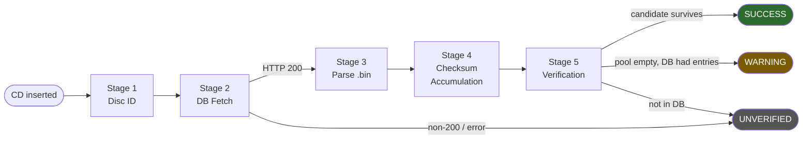
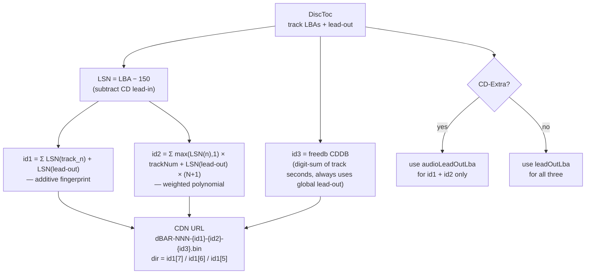
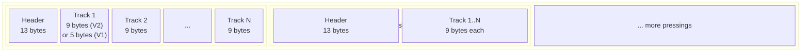
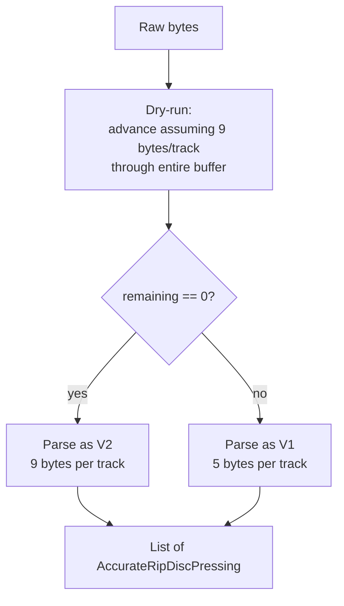
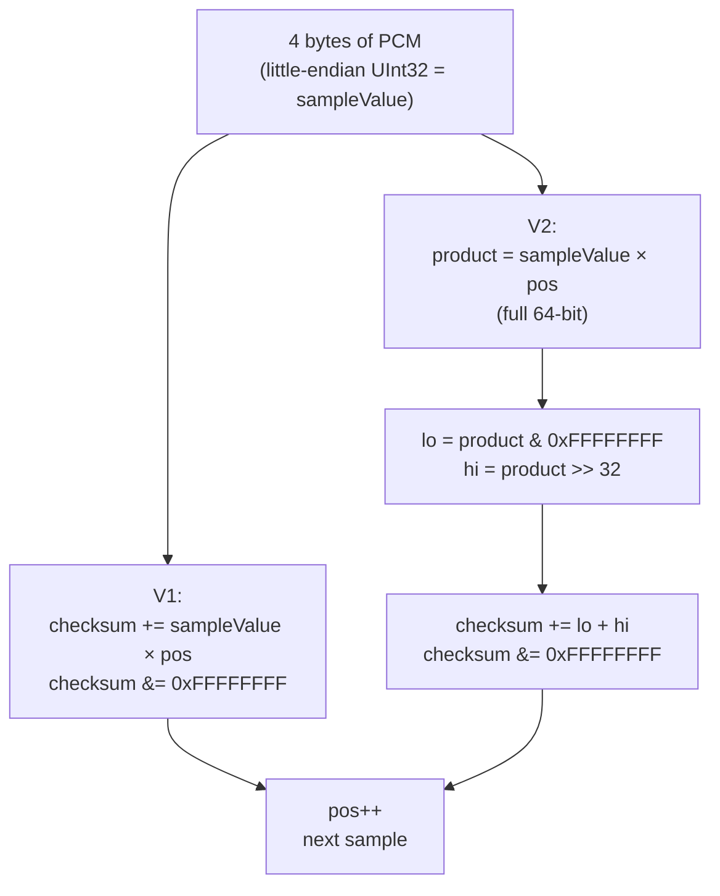
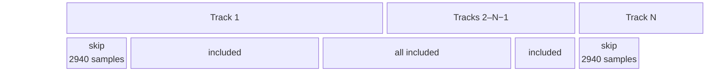
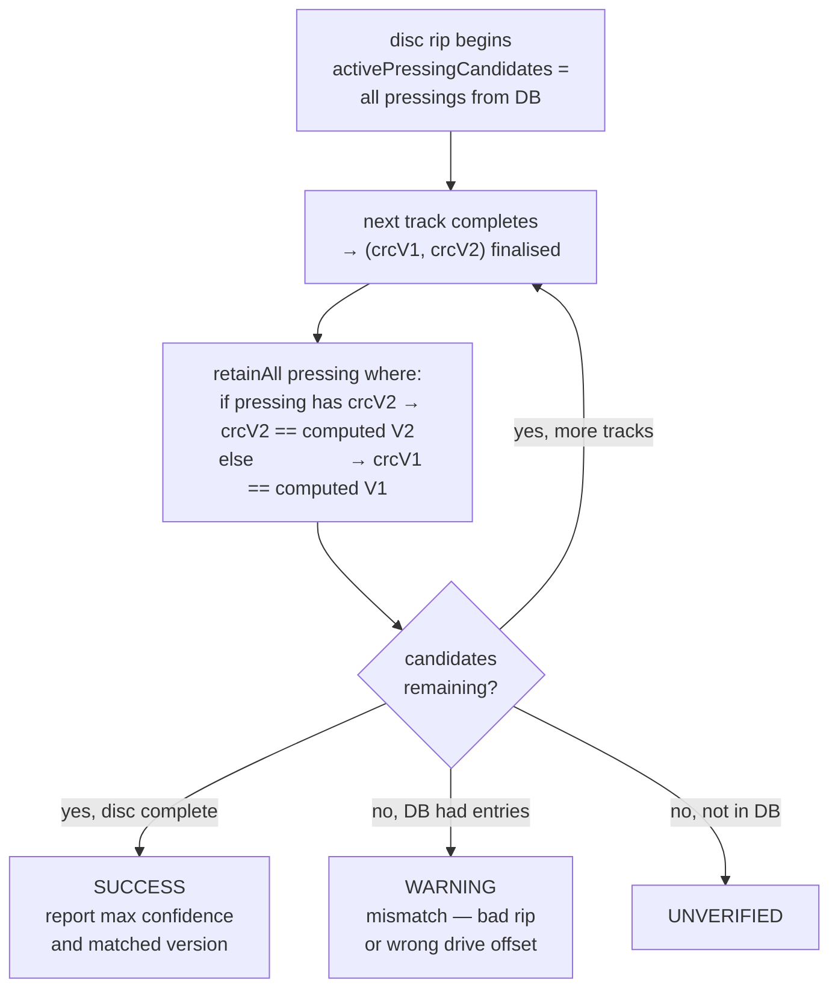
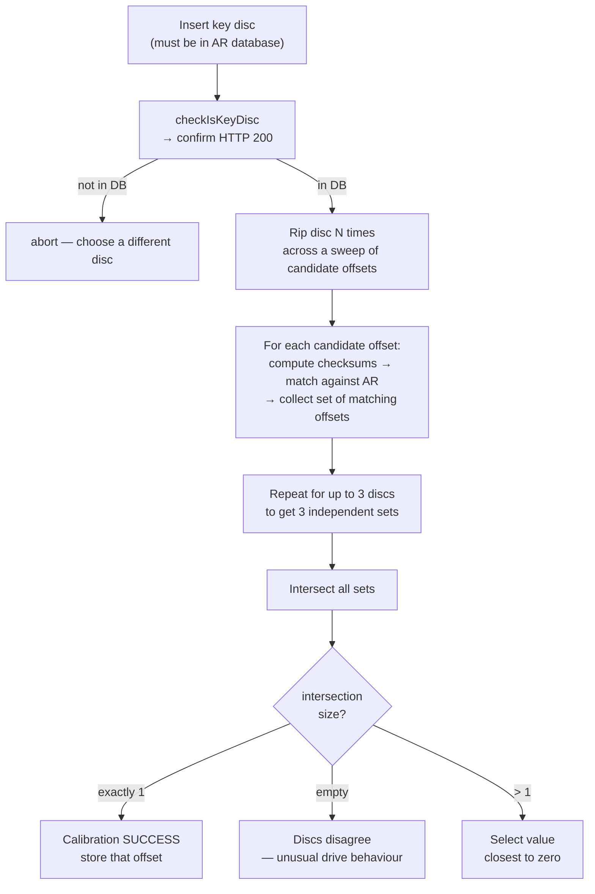

# AccurateRip — Complete Technical Reference

## Overview

AccurateRip is a community-maintained database of per-track CRC checksums derived from rips submitted by thousands of users worldwide. When BitPerfect rips a CD, it computes the same checksums in real time and compares them against the database. A match proves the rip is bit-perfect relative to every other verified copy of the same pressing — independently of whether the raw drive read was perfect.

The pipeline has five distinct stages:



---

## Stage 1 — Disc Identification (`DiscIdUtils.kt`)

The AccurateRip ID is a triple `(id1, id2, id3)` that uniquely identifies a disc. All three components are derived from the TOC's track LBAs (logical block addresses).



### id1 — Sum of LSNs

```
id1 = Σ LSN(track_n)  +  LSN(lead-out)
LSN = LBA − 150
```

Every track offset plus the lead-out is converted to an LSN and summed. Simple additive fingerprint of the layout.

### id2 — Weighted sum of LSNs

```
id2 = Σ ( max(LSN(track_n), 1) × trackNumber )  +  LSN(lead-out) × (trackCount + 1)
```

Each LSN is multiplied by its 1-based track number, with the lead-out treated as track `N+1`. The `max(..., 1)` guard handles degenerate cases where LBA < 150 produces a negative or zero LSN.

### id3 — freedb CDDB ID

```
id3 = (checksum % 255) << 24  |  discLengthSeconds << 8  |  trackCount
```

Where `checksum = Σ digitSum(track_start_seconds)`. This is the classic freedb algorithm. **Important for CD-Extra:** `id1` and `id2` use `audioLeadOutLba` (session-1 boundary) but `id3` always uses the global `leadOutLba` — freedb was defined over total disc length. This intentional asymmetry means the three components of the ID are derived from two different lead-out values on CD-Extra discs.

### URL construction

```
http://www.accuraterip.com/accuraterip/{id1[7]}/{id1[6]}/{id1[5]}/
    dBAR-{trackCount:03d}-{id1:08x}-{id2:08x}-{id3:08x}.bin
```

The three directory levels are hex digits 5, 6, 7 (0-indexed from the right) of `id1`, sharding the CDN across 4096 directories.

---

## Stage 2 — Database Fetch (`AccurateRipService.kt` / `AccurateRipClient.kt`)

`AccurateRipService.getExpectedChecksums(toc)` is called once per disc, before any tracks are ripped:

1. Computes the disc ID and derives the URL
2. Issues an HTTP GET via `AccurateRipClient` (Ktor/OkHttp, `BitPerfect/1.0` User-Agent)
3. On HTTP 200, reads the full response body as raw bytes and forwards to the parser
4. On any non-200 or network error, returns an empty list — the rip proceeds as UNVERIFIED

The full body is read in one shot (`readBytes()`). AccurateRip `.bin` files are small — a 15-track disc with 10 known pressings is ~1.5 KB for V2 format.

`checkIsKeyDisc` is a lightweight variant that only checks for a 200 response without parsing, used by the calibration flow to confirm a disc is in the database before attempting offset convergence.

---

## Stage 3 — Binary Parsing (`AccurateRipVerifier.parseAccurateRipResponse`)

The `.bin` file is a concatenation of disc pressing records. All values are little-endian.

### Binary layout



**Header (13 bytes):**

```
[0]     trackCount : UInt8
[1..4]  discId1    : UInt32 LE
[5..8]  discId2    : UInt32 LE
[9..12] cddbId     : UInt32 LE  ← must be consumed and discarded
```

**Per-track entry:**

```
V1 (5 bytes):              V2 (9 bytes):
[0]    confidence : UInt8  [0]    confidence : UInt8
[1..4] crcV1      : UInt32 [1..4] crcV2      : UInt32  ← stored FIRST
                           [5..8] crcV1      : UInt32  ← stored SECOND
```

The V2 field order is a common trap: `crcV2` is stored first in the binary even though V1 is the older algorithm. The parser explicitly maps `firstCrc → crcV2` and `secondCrc → crcV1`.

The CDDB field must be consumed even though it is discarded. Omitting `buffer.getInt()` for this field shifts the buffer by 4 bytes, causing every subsequent confidence byte to be read from CDDB data. This was a real bug caught by the `CDDB bytes do not appear in parsed CRC` regression test (reproduces the White Blood Cells disc that exposed it).

### V1 vs V2 auto-detection



The dry-run works because a given `.bin` file is internally consistent — all pressing records use the same format.

### Result model

```kotlin
data class AccurateRipTrackMetadata(
    val crcV1: Long,       // 32-bit checksum as unsigned Long
    val crcV2: Long?,      // null for V1-only database entries
    val confidence: Int    // number of independent submitters
)

data class AccurateRipDiscPressing(
    val discId1: Long,
    val discId2: Long,
    val tracks: Map<Int, AccurateRipTrackMetadata>  // 1-based track number
)
```

---

## Worked Example 1 — `dBAR-011-000cb4d1-006e975f-9507580b.bin`

A real AccurateRip response for an 11-track disc. Full file: 224 bytes, V2 format, 2 pressings.

### Filename decode

```
dBAR - 011        - 000cb4d1 - 006e975f - 9507580b .bin
       trackCount   id1        id2        id3(CDDB)
```

CDN path from `id1 = 000cb4d1` → digits at positions 7/6/5 (right to left): `1/d/4/`

Full URL: `http://www.accuraterip.com/accuraterip/1/d/4/dBAR-011-000cb4d1-006e975f-9507580b.bin`

### Byte budget

2 × (13 header + 11 × 9 tracks) = 2 × 112 = **224 bytes** ✓

### Pressing 1 — bytes 0–111

```
Byte  0       : 0x0b              → trackCount = 11
Bytes 1–4     : d1 b4 0c 00 LE   → discId1 = 0x000cb4d1
Bytes 5–8     : 5f 97 6e 00 LE   → discId2 = 0x006e975f
Bytes 9–12    : 0b 58 07 95 LE   → cddb    = 0x9507580b  (consumed, discarded)

Track 01  04 53d11a01 30a3889f  → conf=4  crcV2=0x011ad153  crcV1=0x9f88a330
Track 02  04 60a97926 eb580283  → conf=4  crcV2=0x2679a960  crcV1=0x830258eb
Track 03  04 e024f368 cafa5ab5  → conf=4  crcV2=0x68f324e0  crcV1=0xb55afaca
Track 04  04 9322388a 08db4da7  → conf=4  crcV2=0x8a382293  crcV1=0xa74ddb08
Track 05  04 8d13d2df 0a0c58c6  → conf=4  crcV2=0xdfd2138d  crcV1=0xc6580c0a
Track 06  04 54fbf999 cfd02198  → conf=4  crcV2=0x99f9fb54  crcV1=0x9821d0cf
Track 07  04 db28864b 05723c11  → conf=4  crcV2=0x4b8628db  crcV1=0x113c7205
Track 08  04 3a03f6a7 b12342bf  → conf=4  crcV2=0xa7f6033a  crcV1=0xbf4223b1
Track 09  04 4e62d083 3ee99eb2  → conf=4  crcV2=0x83d0624e  crcV1=0xb29ee93e
Track 10  04 a06e18b6 5b7b356e  → conf=4  crcV2=0xb6186ea0  crcV1=0x6e357b5b
Track 11  04 3ffc154c f4d6bf8a  → conf=4  crcV2=0x4c15fc3f  crcV1=0x8abfd6f4
```

For Track 01: bytes after the confidence byte are `53 d1 1a 01` → `0x011ad153` LE = `crcV2`, then `30 a3 88 9f` → `0x9f88a330` LE = `crcV1`. The reversed field order requires explicit mapping in the parser.

### Pressing 2 — bytes 112–223 (V2-only pressing)

Header identical to pressing 1. Track records:

```
Track 01  02 10058811 00000000  → conf=2  crcV2=0x11880510  crcV1=0x00000000
...
Track 11  02 43ab2975 00000000  → conf=2  crcV2=0x7529ab43  crcV1=0x00000000
```

All `crcV1 = 0x00000000`. This is a V2-only pressing: submitters used a V2-capable ripper that did not back-calculate V1. Zero is AccurateRip's sentinel for an absent V1 field in a V2 record. This is safe in BitPerfect because the elimination logic checks `dbTrack.crcV2 != null` — since `crcV2` is non-null and non-zero for every track here, the V2 branch is always taken and the zero V1 fields are never used.

---

## Worked Example 2 — `dBAR-012-00151845-00c504b0-a70de90c.bin`

A much richer response: **16 pressings** of a 12-track disc, totalling **1936 bytes**.

### Byte budget

16 × (13 + 12 × 9) = 16 × 121 = **1936 bytes** ✓

CDN path from `id1 = 00151845` → `5/4/8/`

### Confidence gradient

The pressings are ordered by submission count, showing clear stratification:

| Pressings | Confidence | Character |
|---|---|---|
| 1 | 18–19 | Primary pressing — most commonly ripped version |
| 2 | 17 | Second most common |
| 3 | 10–12 | Well-verified variant |
| 4–5 | 8–10 | Less common, still reliable |
| 6–8 | 4–7 | Minority pressings |
| 9–15 | 2–4, V2-only | Modern V2-only submissions |
| 16 | 0–2, partial | Partially submitted pressing |

Confidence is per-track, not per-pressing. Pressing 3 shows tracks individually ranging from 10–12, because different submitters may have sent partial datasets.

### Pressing 16 — partial submission (bytes 1815–1935)

```
Track 01: conf=0  crcV2=0x00000000  ← no data
Track 02: conf=0  crcV2=0x00000000  ← no data
Track 03: conf=0  crcV2=0x00000000  ← no data
Track 04: conf=0  crcV2=0x00000000  ← no data
Track 05: conf=2  crcV2=0xa9cf82b5
Track 06: conf=2  crcV2=0xd760597e
Track 07: conf=0  crcV2=0x00000000  ← no data
Track 08: conf=2  crcV2=0xff35c7b2
...
```

Six tracks have `conf=0` and `crcV2=0x00000000`. When elimination reaches one of these tracks, BitPerfect compares the computed checksum against zero — a real rip will almost never produce zero, so this pressing is correctly dropped. The pressing only survives if every non-zero track matches AND the computed checksum coincidentally equals zero on all-zero tracks, which is astronomically unlikely.

### Comparison

| Property | Example 1 | Example 2 |
|---|---|---|
| File size | 224 bytes | 1936 bytes |
| Pressings | 2 | 16 |
| Tracks | 11 | 12 |
| Max confidence | 4 | 19 |
| V2-only pressings | 1 | 8 (pressings 9–16) |
| Partial pressing | None | 1 (pressing 16) |
| Per-track confidence variation | No | Yes |

---

## Stage 4 — Checksum Accumulation (`ChecksumAccumulator.kt`)

A `ChecksumAccumulator` is created per track at the start of each rip. As decoded PCM sectors arrive in chunks, `accumulate(pcmData)` is called repeatedly, computing V1 and V2 in a single pass.

> `AccurateRipVerifier.computeChecksumChunk()` is an older single-pass helper marked `@Deprecated`. The canonical hot-path is `ChecksumAccumulator.accumulate()`.

### The checksum algorithm

Both algorithms iterate over every 4-byte stereo sample frame assembled as a little-endian `UInt32`.



**V1:**
```
checksum += sampleValue × samplePosition
checksum &= 0xFFFFFFFF
```

**V2:**
```
product = sampleValue × samplePosition   // full 64-bit
lo = product & 0xFFFFFFFF
hi = (product >> 32) & 0xFFFFFFFF
checksum += lo + hi
checksum &= 0xFFFFFFFF
```

V2's `lo + hi` fold detects a class of mastering errors — from certain pressing plants that produced consistent off-by-one artefacts at 32-bit word boundaries — that V1 silently passes. `samplePosition` is 1-based, threaded through successive `accumulate()` calls so chunk boundaries are transparent.

### Exclusion windows

The first and last 2940 samples (5 sectors = 5 × 588) of the disc are excluded — not of each track, but of the first and last track specifically. This compensates for drives applying different amounts of pregap/postgap silence at disc boundaries.



```kotlin
val skipStart = if (isFirstTrack) 2940L else 0L
val skipEnd   = if (isLastTrack)  2940L else 0L

if (currentSamplePos >= skipStart && currentSamplePos <= totalSamples - skipEnd) {
    // accumulate
}
```

> ⚠️ **Known spec divergence:** The reference implementations (whipper, accuraterip-checksum/C, EAC) use a strict `> skipStart` condition, making position 2941 the first included sample for the first track. BitPerfect uses `>= skipStart`, making position 2940 the first included. In practice this is masked by multi-pressing databases — if any pressing was submitted by a ripper with the same boundary, it will match. But for discs with few pressings submitted exclusively by EAC/dBpoweramp, track 1 verification may intermittently fail. See the gap analysis.

### Drive offset compensation

CD drives have a per-model read offset. Before accumulation begins, `RipManager` decomposes the stored offset:

- `tocOffset` — whole sectors (`offset ÷ 588`, rounded toward zero) — shifts the LBA range read
- `sampleOffset` — fractional samples (`offset mod 588`)
- `skipBytes` — bytes trimmed from the first sector (`sampleOffset × 4`)

This aligns the PCM fed to `ChecksumAccumulator` with the track boundary AccurateRip expects, regardless of where the drive physically started reading.

### Finalisation

`finalise()` returns `Pair<Long, Long>` of `(crcV1, crcV2)`, both masked to 32 bits.

---

## Stage 5 — Verification (`RipManager.kt`)

After all sectors for a track are ripped and the FLAC written, the finalised checksums are compared against the database using **progressive candidate elimination**.

### Candidate elimination



The pool is maintained at disc level across all tracks. Without this, a rip could match Track 1 of Pressing A and Track 2 of Pressing B and incorrectly pass. A pressing is eliminated the moment any single track fails to match.

### Elimination logic

```kotlin
activePressingCandidates.retainAll { pressing ->
    val dbTrack = pressing.tracks[trackNumber] ?: return@retainAll false
    if (dbTrack.crcV2 != null) {
        dbTrack.crcV2 == finalChecksumV2
    } else {
        dbTrack.crcV1 == finalChecksumV1
    }
}
```

V2 takes precedence when the database entry has one. A pressing with `crcV2 = null` is a V1-only entry and falls through to the V1 comparison.

### Status classification

| Condition | Status |
|---|---|
| `activePressingCandidates` non-empty | `SUCCESS` |
| Pool empty, database had entries | `WARNING` |
| Track absent from database entirely | `UNVERIFIED` |

The matched version (1 or 2) and maximum confidence across surviving pressings are also reported. Confidence ≥ 3 is generally considered reliable. When reporting expected checksums for the UI or log, BitPerfect always reads from the original unfiltered `expectedChecksums` list, never from the filtered candidate pool — so the display accurately shows what the database holds even after all candidates are eliminated.

Results are written to a per-album `accuraterip.jsonl` file containing `isVerified`, `checksumMatched`, `matchedVersion`, `confidence`, `inDatabase`, `checksumV1`/`checksumV2` as `0xHEX` strings, and the full expected checksum lists.

---

## Drive Offset Calibration (`OffsetCalibrationViewModel.kt`)

AccurateRip is also the mechanism used to determine the per-drive sample read offset.



The intersection approach prevents a false result from a single lucky match at an incorrect offset. The ASUS SDRW-08D2S-U used in development converges on **+6 samples**.

Note: if only one key disc is available, the intersection degenerates to a single set — it still finds the correct offset, but provides no cross-disc confirmation.

---

## Key Bugs Fixed (Historical)

| Bug | Symptom | Fix |
|---|---|---|
| Missing CDDB field consumption | Buffer offset wrong for all tracks — confidence byte read from CDDB data | Added `buffer.getInt()` to consume the 4-byte CDDB before reading track records |
| V2 field order misread | `crcV1` and `crcV2` swapped in parsed output | Corrected: binary stores `crcV2` first, `crcV1` second in V2 format |
| `audioLeadOutLba` vs `leadOutLba` for CD-Extra | Wrong disc ID, CDN miss for all CD-Extra discs | Use `audioLeadOutLba` (session-1 lead-out) for id1/id2 when present |
| Inter-session gap constant | `11250` used instead of `11400` frames | Corrected constant |
| 64-bit overflow in V1 accumulator | `sampleValue × samplePosition` overflowed without masking | Mask result to `0xFFFFFFFFL` after each sample |
| dBAR header parsed as 9 bytes | CDDB 4-byte field not consumed, producing phantom expected values | Full 13-byte header now consumed |

---

## Gap Analysis & Known Issues

### Issue 1 — Exclusion Window Off-By-One at Track Start ⚠️ Medium Severity

**Location:** `ChecksumAccumulator.accumulate()` and `AccurateRipVerifier.computeChecksumChunk()`

BitPerfect uses `currentSamplePos >= skipStart` making position 2940 the first included sample. The reference implementations (whipper, accuraterip-checksum/C, EAC, dBpoweramp) use a strict `>`, making position 2941 the first included.

The difference per track is exactly `sample[2940] × 2940 mod 2³²` — for any non-silence sample at that position, this produces a completely different checksum from the database value.

**Why it doesn't always fail in practice:** The AccurateRip database aggregates submissions from many rippers, some of which historically used the same `>= 2940` boundary. A disc with 16 pressings submitted by diverse rippers will likely have at least one entry matching BitPerfect's boundary. A disc with 1–2 pressings submitted exclusively by EAC will not. Verification reliability is therefore disc-dependent.

**The end boundary is correct:** `<= totalSamples - skipEnd` matches the reference (`< totalSamples - skipEnd + 1`). Only the start is affected.

**Fix:**
```kotlin
// Both ChecksumAccumulator.accumulate() and AccurateRipVerifier.computeChecksumChunk()
// Change:
currentSamplePos >= skipStart
// To:
currentSamplePos > skipStart
```

Update the `ChecksumAccumulatorTest` test name and assertion: the test currently asserts the buggy behaviour as correct.

---

### Issue 2 — Silent Byte Truncation on Non-Sector-Aligned Input ⚠️ Medium Severity

**Location:** `ChecksumAccumulator.accumulate()`

```kotlin
for (i in 0 until (pcmData.size / 4) * 4 step 4)
```

Trailing 1–3 bytes are silently dropped if `pcmData.size % 4 != 0`. They are not carried over — they vanish from the checksum permanently. In the current call path (whole 2352-byte sectors, `2352 % 4 == 0`) this never fires. However the `skipBytes` trimming path produces slices where `skipBytes % 4 != 0` is theoretically possible.

**Fix:** Add a precondition:
```kotlin
require(pcmData.size % 4 == 0) { "PCM data must be whole sample frames (multiple of 4 bytes)" }
```

---

### Issue 3 — freedb CDDB Leadout Asymmetry Undocumented 🟢 Low

On CD-Extra, `id1` and `id2` use `audioLeadOutLba` while `id3` (freedb) always uses `leadOutLba`. This is intentional but undocumented in code comments. An implementer reading only the code would likely use the same lead-out for all three components. The `maxOf(lsn, 1L)` guard for negative LSN (when LBA < 150) is similarly unexplained.

---

### Issue 4 — matchedVersion Ambiguous for Mixed V1/V2 Survivors 🟢 Low

**Location:** `RipManager.kt`

```kotlin
if (activePressingCandidates.any { it.tracks[trackNumber]?.crcV2 == finalChecksumV2 }) 2 else 1
```

If both a V1-only pressing and a V2 pressing survive elimination, `matchedVersion = 2` is reported even though the V1 pressing also independently verified the rip. The result is correct (the rip is verified) but the version signal is overstated. No test covers this mixed-version survival case.

---

### Issue 5 — Single-Track Disc Under ~80 Seconds Produces Zero Checksum 🟢 Low

When `isFirstTrack = isLastTrack = true` and `totalSamples < 5881`, the inclusion window `(> skipStart) AND (<= totalSamples - skipEnd)` is empty or inverted — no samples accumulate and the checksum is 0. Since `0x00000000` is also the zero-sentinel used in partial database submissions (pressing 16 in example 2), a coincidental false match is theoretically possible, though astronomically unlikely in practice.

---

### Issue 6 — No Ground-Truth Disc ID Test Against Real `.bin` Filenames 🟢 Low

The test suite verifies disc IDs for several known discs but none correspond to the two example `.bin` files. Adding test fixtures that reconstruct the TOC for those discs and assert that `computeAccurateRipDiscId` produces the IDs embedded in the filenames would provide end-to-end ground truth linking the ID algorithm to real fetched database files.

---

### Issue 7 — Deprecated `computeChecksumChunk` Has a Stale Self-Referential Message 🟢 Low

The deprecation reads `"Replaced by computeChecksumChunk — remove after RipManager is updated in Chunk 2"`. It names itself as its own replacement and references a stale milestone. Should be corrected to reference `ChecksumAccumulator` or the method removed.

---

### Summary Table

| # | Severity | Area | Issue | Fix |
|---|---|---|---|---|
| 1 | 🟡 Medium | Checksum | Start boundary includes pos 2940; reference starts at 2941. Intermittent track 1 mismatch on low-pressing discs. | `>= skipStart` → `> skipStart` in two places |
| 2 | 🟡 Medium | Checksum | Non-multiple-of-4 input silently drops trailing bytes | Add `require(pcmData.size % 4 == 0)` |
| 3 | 🟢 Low | Disc ID | CD-Extra leadout asymmetry (id3 uses global leadout) undocumented | Add code comment |
| 4 | 🟢 Low | Verification | `matchedVersion` overstates V2 when V1 pressing also survives | Document or fix |
| 5 | 🟢 Low | Checksum | Single-track disc < 80s produces zero checksum | Guard or document |
| 6 | 🟢 Low | Tests | No disc ID test uses real `.bin` filenames as ground truth | Add fixtures |
| 7 | 🟢 Low | Housekeeping | `@Deprecated` message names itself and references stale milestone | Fix message or delete method |
