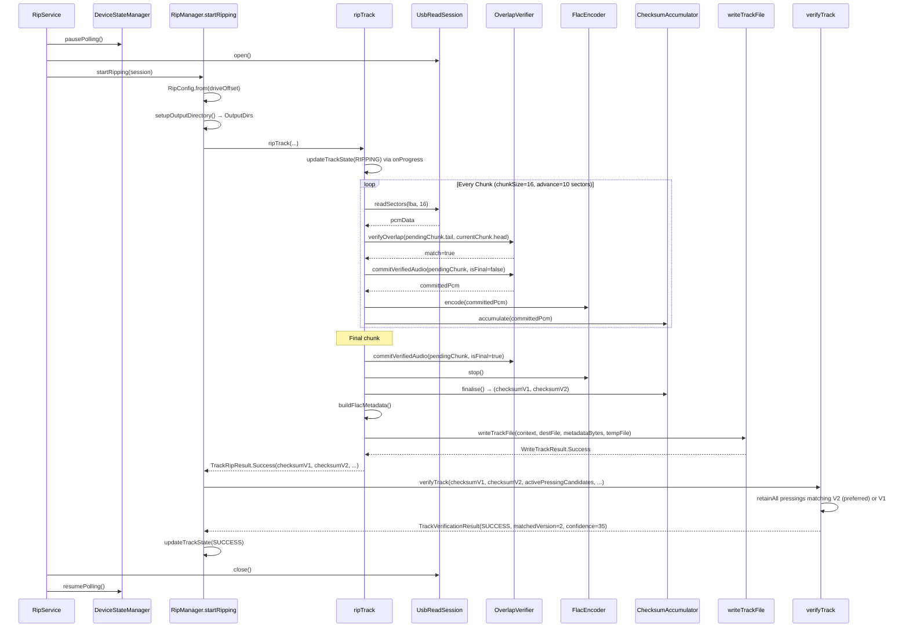
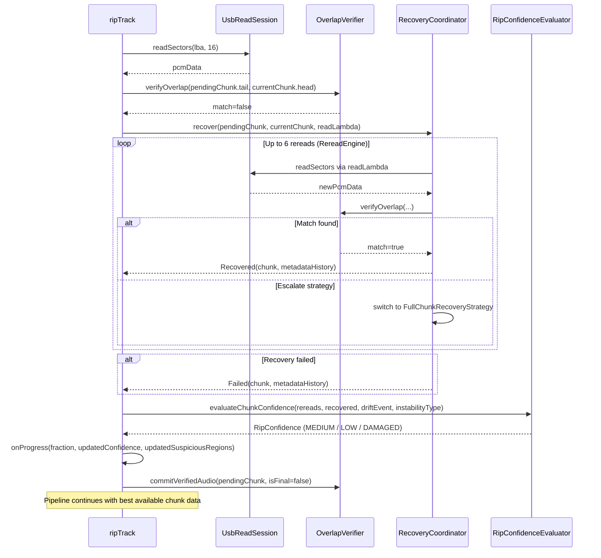
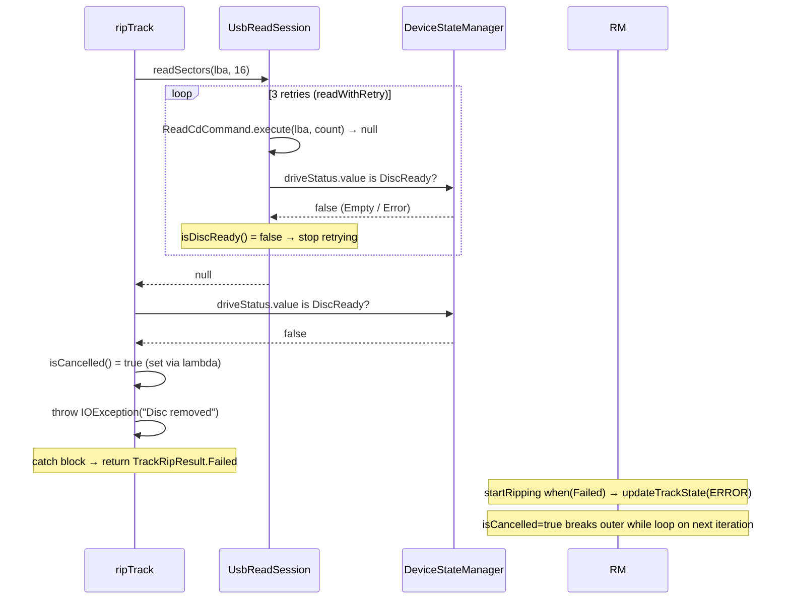

# RipManager Architecture

Accurate as of `RipManager.kt` rev in BitPerfect-main (June 2026), following the Phases 0–5 refactor.

---

## 1. Overview

`RipManager` orchestrates the entire CD extraction pipeline. It owns:

- Session-level setup (drive offset, directory creation, forensic logger init, AudioDB fetch)
- A per-track extraction loop (LBA calculation, sector reads, paranoia verification, FLAC encoding)
- Post-extraction work (AccurateRip verification, metadata/artwork/lyrics embedding, JSONL log writing)
- Drive-level teardown (eject on full-disc success)

It is instantiated once per rip session by `RipService`, which also owns the `UsbReadSession` lifecycle (polling pause/resume). `RipManager` receives the open session as a parameter and never touches polling itself.

Following the Phases 0–5 refactor, the bulk of `startRipping`'s logic has been extracted into four testable `internal` functions: `setupOutputDirectory`, `ripTrack`, `verifyTrack`, and `writeTrackFile`. `startRipping` itself is now a pure orchestrator.

---

## 2. File Structure

```
RipManager.kt
├── internal fun setupOutputDirectory(...)   : OutputDirs
├── internal fun verifyTrack(...)            : TrackVerificationResult
├── internal fun writeTrackFile(...)         : WriteTrackResult
├── internal suspend fun ripTrack(...)       : TrackRipResult
│
├── enum class RipStatus
├── data class TrackRipState
│
└── class RipManager
    ├── fun queueTrack(trackNumber: Int)
    ├── suspend fun startRipping(session: UsbReadSession)
    ├── fun cancel()
    ├── fun deleteRipFiles()
    ├── val trackStates: StateFlow<...>
    └── [private helpers: updateTrackState, buildFlacMetadata,
        writeAccurateRipJsonl, normalizeMeta, detectMimeType]

RipConfig.kt
└── data class RipConfig
    └── companion object { fun from(driveOffset: Int): RipConfig }

TrackRipResult.kt
├── data class TrackRipStats
├── sealed class TrackRipResult { Success | Failed | Cancelled }
├── data class TrackVerificationResult
└── sealed class WriteTrackResult { Success | Failed }
```

---

## 3. Constructor Inputs

| Parameter | Type | Purpose |
|---|---|---|
| `context` | `Context` | SAF file I/O, MediaStore scanning |
| `outputFolderUriString` | `String` | Root SAF tree URI for Artist/Album directory creation |
| `toc` | `DiscToc` | Full TOC: track LBAs, pregap offset, lead-out LBA |
| `metadata` | `DiscMetadata` | Artist, album, track titles, disc/total discs, MusicBrainz ID, tags |
| `expectedChecksums` | `List<AccurateRipDiscPressing>` | All known pressings from AccurateRip DB for this disc |
| `artworkBytes` | `ByteArray?` | Cover art (JPEG or PNG) for FLAC PICTURE block |
| `lyricsMap` | `Map<Int, LyricsFetchResult>` | Per-track lyrics (plain + synced LRC) from LRCLIB |
| `driveVendor` / `driveProduct` | `String` | Used for offset lookup and forensic log |
| `initialTracks` | `List<Int>` | Track numbers to rip in this session |
| `previousStates` | `Map<Int, TrackRipState>?` | Preserved states for tracks not being re-ripped (partial re-rip support) |

**Key instance-level state initialised at construction:**

- `_trackStates`: `MutableStateFlow<Map<Int, TrackRipState>>` — the single source of truth for UI. Initialised from `toc.tracks`, optionally merging `previousStates` for tracks not in `initialTracks`.
- `activePressingCandidates`: `MutableSet<AccurateRipDiscPressing>` — starts as a copy of all known pressings; progressively filtered down track-by-track during AccurateRip verification.
- `trackQueue`: `ConcurrentLinkedQueue<Int>` — ordered list of tracks to process.

---

## 4. Public API

```
fun queueTrack(trackNumber: Int)
suspend fun startRipping(session: UsbReadSession)
fun cancel()
fun deleteRipFiles()
val trackStates: StateFlow<Map<Int, TrackRipState>>
var isCancelled: Boolean  (read-only externally)
```

`startRipping` is the entire pipeline — it is a single `suspend fun` that runs until all queued tracks are done, cancelled, or have errored. It is called on `Dispatchers.IO` by `RipService`.

---

## 5. `RipConfig`

`RipConfig` holds all drive-offset-derived constants for a session. It is constructed once at the top of `startRipping` and passed into `ripTrack`.

```kotlin
data class RipConfig(
    val chunkSize: Int,       // default 16 sectors per read
    val overlapSize: Int,     // default 6 sectors overlap between chunks
    val driveOffset: Int,     // raw offset in samples (from DriveOffsetRepository)
    val tocOffset: Int,       // whole-sector component: driveOffset / 588 (floor)
    val sampleOffset: Int,    // sub-sector remainder: driveOffset % 588 (always ≥ 0)
    val skipBytes: Int        // sampleOffset * 4 — bytes to trim from first committed PCM
)
```

**Offset decomposition:** a positive drive offset means the drive reads slightly ahead of the requested LBA. `tocOffset` shifts the physical LBA window; `sampleOffset` is the fractional sub-sector remainder. For negative offsets, Kotlin `%` returns a negative remainder, so `RipConfig.from()` normalises to a positive `sampleOffset` by adding 588 and decrementing `tocOffset`.

---

## 6. `startRipping` — Top-Level Execution Flow

```
startRipping(session)
├── Resolve drive offset (DriveOffsetRepository) → RipConfig.from(driveOffset)
├── Init DefaultForensicRipLogger, record SessionStarted
├── setupOutputDirectory() → OutputDirs(artistDir, albumDir)
├── Launch fire-and-forget coroutine: fetch artist.json from AudioDB
├── Compute AccurateRip URL
│
├── while (trackQueue.isNotEmpty())
│   ├── Compute track geometry (entry.lba, nextLba, totalSectors, totalSamples)
│   ├── Build filename, create SAF destination file
│   ├── ripTrack(...) → TrackRipResult
│   └── when (ripResult)
│       ├── Cancelled → break
│       ├── Failed    → updateTrackState(ERROR), continue
│       └── Success   →
│           ├── updateTrackState(RIPPING, final sectors/confidence/suspiciousRegions)
│           ├── MediaScannerHelper.scanSafUri()
│           ├── verifyTrack(...) → TrackVerificationResult
│           ├── updateTrackState(final status: SUCCESS / UNVERIFIED / WARNING)
│           ├── writeAccurateRipJsonl()
│           └── logger.record(TrackCompleted)
│
├── (if !isCancelled) Post-session analysis — §9
└── (if !isCancelled && all tracks terminal) DeviceStateManager.ejectDrive()
```

---

## 7. `setupOutputDirectory`

```kotlin
internal fun setupOutputDirectory(
    context: Context,
    outputFolderUriString: String,
    artistName: String,
    albumTitle: String,
    resolver: DirectoryResolver = ...  // default: DocumentFile.fromTreeUri
): OutputDirs
```

Resolves the SAF output root, creates `Artist/` and `Album/` sub-directories (idempotent — uses `findFile` before `createDirectory`), and returns `OutputDirs(artistDir, albumDir)`. Sanitises artist and album names by replacing `/` with `_`.

Throws `IOException` on any of:
- URI resolves to null / non-existent / non-directory
- `createDirectory` returns null for either level

The `DirectoryResolver` parameter is a `fun interface` seam that allows tests to inject a fake `DocumentFile` tree without `mockkStatic`.

`startRipping` wraps the call in `try/catch(IOException)`, logs via `AppLogger.e`, and returns early on failure.

---

## 8. `ripTrack`

```kotlin
internal suspend fun ripTrack(
    context: Context,
    trackNumber: Int,
    i: Int,
    entry: DiscTocTrack,
    nextLba: Int,
    totalSectors: Int,
    totalSamples: Long,
    trackTitle: String,
    lyricsResult: LyricsResult?,
    destFile: DocumentFile,
    config: RipConfig,
    toc: DiscToc,
    metadata: DiscMetadata,
    accurateRipUrl: String?,
    artworkBytes: ByteArray?,
    expectedChecksums: List<AccurateRipDiscPressing>,
    activePressingCandidates: Set<AccurateRipDiscPressing>,  // snapshot — read-only
    session: UsbReadSession,
    metricsCollector: ReadSizeMetricsCollector,
    logger: DefaultForensicRipLogger,
    incomingOverreadBuffer: ByteArray?,
    isCancelled: () -> Boolean,
    trackStartTimeMs: Long,
    onProgress: (fraction: Float, confidence: RipConfidence?, suspiciousRegions: List<SuspiciousRead>?) -> Unit
): TrackRipResult
```

Owns the full per-track rip from temp file creation through SAF write. Returns one of:

| Result | Meaning |
|---|---|
| `TrackRipResult.Success` | Track ripped and written. Carries checksums, stats, overreadBuffer, streamingReads. |
| `TrackRipResult.Failed(reason)` | Any caught exception. Caller applies `ERROR` state. |
| `TrackRipResult.Cancelled` | `isCancelled()` observed true mid-loop. Caller breaks the while-loop. |

**`activePressingCandidates` is passed as a read-only snapshot.** The live `MutableSet` mutation (`retainAll`) happens in `verifyTrack` after `ripTrack` returns. This means mid-rip progress updates embedded in FLAC Vorbis comments use the snapshot state for the current track, not the progressively filtered live set.

**`onProgress`** is called for both plain progress fraction updates (confidence/suspiciousRegions = null) and paranoia state updates during overlap mismatches (non-null confidence/suspiciousRegions). `startRipping` forwards these directly to `updateTrackState`.

**`finally` block** (always runs):
1. `encoder?.stop()`
2. `tempOutputStream?.close()`
3. `tempFile.delete()`

SAF destination cleanup on failure is the responsibility of `writeTrackFile`.

### 8.1 Sector Read Loop

See §10 for the full loop description. `ripTrack` is the function that contains it.

---

## 9. `verifyTrack`

```kotlin
internal fun verifyTrack(
    trackNumber: Int,
    checksumV1: Long,
    checksumV2: Long,
    activePressingCandidates: MutableSet<AccurateRipDiscPressing>,  // mutated in-place
    expectedChecksums: List<AccurateRipDiscPressing>
): TrackVerificationResult
```

Performs AccurateRip verification for one track and returns a `TrackVerificationResult`:

```kotlin
data class TrackVerificationResult(
    val finalStatus: RipStatus,       // SUCCESS | UNVERIFIED | WARNING
    val matchedVersion: Int?,         // 1 or 2, null if no match
    val matchedConfidence: Int?,      // highest confidence among surviving pressings
    val allExpectedV1: List<Long>,    // from full expectedChecksums (not filtered)
    val allExpectedV2: List<Long>,    // from full expectedChecksums (not filtered)
    val hasExpected: Boolean          // true if DB has any entry for this disc
)
```

**Cross-track cumulative filter:** `activePressingCandidates.retainAll { ... }` eliminates any pressing whose entry for this track does not match. V2 is preferred: if a pressing's track entry has a non-null `crcV2`, it must match `checksumV2`; otherwise `crcV1` must match `checksumV1`. A pressing eliminated on track 2 is gone for all subsequent tracks, matching EAC behaviour.

**`allExpectedV1/V2` are always derived from the full `expectedChecksums` list**, not from the filtered candidates. This ensures the log always shows every hash the AccurateRip database holds for this disc, regardless of which pressings survived.

**Final status logic:**
- `SUCCESS` — at least one pressing still in `activePressingCandidates` after `retainAll`.
- `UNVERIFIED` — `hasExpected` is false (disc not in AccurateRip DB at all).
- `WARNING` — DB has entries but none survived the filter.

---

## 10. `writeTrackFile`

```kotlin
internal fun writeTrackFile(
    context: Context,
    destFile: DocumentFile,
    metadataBytes: ByteArray,
    tempFile: java.io.File
): WriteTrackResult
```

Opens the SAF output stream via `context.contentResolver.openOutputStream(destFile.uri)`, wraps it in a 1 MB `BufferedOutputStream`, writes `metadataBytes` first, then copies the temp file, then calls `flush()`.

Returns `WriteTrackResult.Success` or `WriteTrackResult.Failed(reason)`.

On any exception: calls `destFile.delete()` to remove the partial SAF file before returning `Failed`. The `finally` block closes the output stream.

**Responsibility boundary:** `writeTrackFile` owns the SAF destination lifecycle on failure. `ripTrack`'s `finally` block owns the local `tempFile` lifecycle.

---

## 11. `startRipping` — Per-Track Orchestration Detail

```
while (trackQueue.isNotEmpty())
├── Guard: isCancelled → break
├── Dequeue trackNumber
├── Compute: entry, nextLba, totalSectors, totalSamples
├── updateTrackState(RIPPING, 0f)
├── logger.record(TrackStarted)
├── Build filename (disc-number-prefixed if multi-disc)
├── albumDir.findFile(filename)?.delete()   // remove stale file
├── albumDir.createFile(...)  →  destFile (null → ERROR + continue)
│
├── ripTrack(...) → ripResult
│
└── when (ripResult)
    ├── Cancelled → break
    ├── Failed    → updateTrackState(ERROR, reason), continue
    └── Success   →
        ├── overreadBuffer = ripResult.overreadBuffer
        ├── allStreamingReads.addAll(ripResult.streamingReads)
        ├── updateTrackState(RIPPING, final sectors/confidence/suspicious)
        ├── MediaScannerHelper.scanSafUri()
        ├── updateTrackState(VERIFYING, 1f)
        ├── verifyTrack(checksumV1=ripResult.checksumV1, ...) → verification
        ├── updateTrackState(verification.finalStatus, checksums, arConfidence)
        ├── writeAccurateRipJsonl(albumDir, currentState)
        └── logger.record(TrackCompleted(..., summary=ripResult.stats))
```

---

## 12. Sector Read Loop (inside `ripTrack`)

**Loop invariant:** `sectorsRead < effectiveTotalSectors && !isCancelled()`

**Chunk parameters (from `RipConfig`):** `chunkSize = 16`, `overlapSize = 6`, initial `advanceSize = 10`.

Each iteration:

1. **Read** `min(chunkSize, remaining)` sectors via `session.readSectors(readStartLba, sectorsToRead)`.

2. **On null (transport failure):**
   - Record `TRANSPORT_FAILURE` log event.
   - If `driveStatus != DiscReady`: set `isCancelled = true`, throw `IOException` (disc removed path).
   - Otherwise: downgrade confidence to `DAMAGED`, append `SuspiciousRead`, throw `IOException`.

3. **On success:** Wrap in `VerifiedChunk` with overlap head/tail extracted.

4. **Overlap verification** (only when `pendingChunk != null`, i.e. not the first chunk):
   - **Match:** report to `fastPathEvaluator`; `committedPcm = overlapVerifier.commitVerifiedAudio(pendingChunk, isFinal = false)`.
   - **Mismatch:** invoke `recoveryCoordinator.recover(...)`; build `SuspiciousRead`; evaluate chunk confidence; call `onProgress` with updated confidence/suspiciousRegions; `committedPcm = overlapVerifier.commitVerifiedAudio(pendingChunk, isFinal = false)`.

5. **Sample alignment validation** when both `committedPcm` and `lastCommittedPcm` are non-null: `alignmentValidator.validateBoundary`. Anomalies may further downgrade confidence.

6. **Encode + accumulate:** if `committedPcm != null`: apply `skipBytes` trim on first sector, encode via `FlacEncoder`, accumulate checksums, feed `AudioAnalyser`.

7. **Final chunk detection:** `(sectorsRead + dynamicAdvance) >= effectiveTotalSectors` or short read. If final: flush `pendingChunk` via `commitVerifiedAudio(isFinal = true)`.

8. **Advance `sectorsRead`:** final chunk by `sectorsActuallyRead`; normal chunks by `dynamicAdvance` (`chunkPcmSize / 2352 - overlapSizeBytes / 2352`).

9. **`onProgress(fraction, null, null)`** at end of each iteration.

**Overlap commit semantics:** `commitVerifiedAudio(chunk, isFinal = false)` returns `chunk.pcm` minus the trailing overlap region — the overlap is held back until the next chunk validates it. `isFinal = true` returns the full remaining PCM including the overlap tail.

---

## 13. FLAC File Construction

The temp-file / final-file split exists because FLAC metadata (specifically `STREAMINFO.totalSamples`) must be written before the audio stream, but audio analysis (`BPM`, `ReplayGain`) runs after encoding completes.

**Write sequence (inside `ripTrack`, then `writeTrackFile`):**
1. Audio frames → `temp_rip_N.flac` in cache dir via `FlacEncoder` (raw frames, no FLAC header).
2. `AudioAnalyser.analyse()` → `audioAnalysis` (BPM, key, ReplayGain, energy).
3. `buildFlacMetadata()` → in-memory `ByteArray` containing:
   - `fLaC` marker
   - `STREAMINFO` block (44100 Hz, 16-bit stereo; `totalSamples` from TOC geometry; MD5 zeroed)
   - `VORBIS_COMMENT` block (artist, album, title, track, disc, year, genre, albumArtist, MusicBrainz ID, AccurateRip disc ID, plain lyrics, synced lyrics, BitDepth, SampleRate, BPM, key, ReplayGain, energy, style tags)
   - `PICTURE` block (front cover, if artwork present)
4. `writeTrackFile(context, destFile, metadataBytes, tempFile)` — header bytes first, then temp file contents, via a 1 MB buffered SAF stream.

**Metadata sanitisation:** `normalizeMeta()` normalises smart quotes and Unicode dashes to ASCII before embedding.

---

## 14. Supporting Private Methods

| Method | Purpose |
|---|---|
| `updateTrackState(...)` | Merges partial updates into `_trackStates` using `copy()`. All fields are optional; existing values are preserved for nulls. |
| `buildFlacMetadata(...)` | Constructs the in-memory FLAC header (see §13). |
| `writeAccurateRipJsonl(...)` | Upserts a per-track JSON entry into `BitPerfect.jsonl` in the album directory. Reads existing entries, removes any prior entry for the same disc+track, appends new entry, rewrites the whole file. Triggers MediaStore scan after write. |
| `normalizeMeta(String)` | ASCII normalisation of smart quotes and Unicode dashes. |
| `detectMimeType(ByteArray)` | Magic-byte detection for JPEG (`FF D8 FF`) and PNG (`89 50 4E 47`); falls back to `image/jpeg`. |

---

## 15. Post-Session Analysis

Runs once after all tracks are processed, only if `!isCancelled`.

1. **`DefaultAtomicReadProfiler`**: analyses `ReadSizeMetricsCollector` data across all tracks — preferred read size, max reliable read size, unstable sizes.
2. **`DefaultStreamingBehaviorAnalyzer`**: analyses all `SequentialReadTelemetry` accumulated across every track via `allStreamingReads`.
3. **`DefaultDriveProfiler`**: combines cache probe result, streaming analysis, and read size profile into a `DriveProfile`.
4. `logger.record(DriveAnalysisCompleted)` and `logger.record(SessionCompleted)`.
5. `logger.finalize(context, albumDir)` — writes the forensic JSONL log to the album directory.
6. If all tracks are `SUCCESS | UNVERIFIED | WARNING`: `DeviceStateManager.ejectDrive()`.

---

## 16. Sequence Diagrams

### 16.1 Happy Path: Successful Track Extraction



### 16.2 Overlap Mismatch and Recovery



### 16.3 Transport Failure (Disc Removed)



---

## 17. Test Coverage

| Test File | What it covers |
|---|---|
| `RipConfigTest` | `RipConfig.from()` offset decomposition: zero, positive (+667), negative (−30), invalid constraint |
| `SetupOutputDirectoryTest` | SAF directory creation via `DirectoryResolver` seam: valid tree, name sanitisation (`/` → `_`), null resolver return, null `createDirectory` for artist |
| `RipTrackTest` | Five end-to-end `ripTrack` scenarios: clean read checksums (pinned 0L/0L for all-zero input), mid-loop cancellation, null sector read failure, single overlap mismatch with recovery, positive drive offset overread buffer |
| `VerifyTrackTest` | Six `verifyTrack` unit tests: V1 match, V2 match, mismatch → WARNING, no expected → UNVERIFIED, candidate elimination (set mutation), highest confidence selection |
| `WriteTrackFileTest` | Four `writeTrackFile` tests: success with byte-order assertion, null stream → Failed, write exception → Failed + destFile.delete(), empty temp file |
| `RipManagerChecksumTest` | `ChecksumAccumulator` V1/V2 formula correctness |

---

## 18. Known Structural Issues

These are observations about the current structure, not bugs.

**`buildFlacMetadata` belongs in `FlacEncoder` or a dedicated `FlacHeaderBuilder`.** It manually assembles FLAC binary blocks (1,140 bytes of byte-twiddling) and is a private method of `RipManager` with no direct test coverage.

**`writeAccurateRipJsonl` reads and rewrites the entire file on every track.** For a 15-track album this is 15 full read+write cycles on a SAF URI. An append-only approach would be simpler.

**`activePressingCandidates` is mutable shared state across all tracks.** The cross-track cumulative filter is intentional (matching EAC behaviour) but makes it impossible to verify tracks independently. It is now explicitly surfaced as a `MutableSet` parameter to `verifyTrack`, making the mutation visible.

**`isCancelled` is set both externally (`cancel()`) and internally** (on disc-removed `IOException` path inside `ripTrack`, communicated back via the `isCancelled` lambda). Both paths only ever set to `true`, so they are safe, but the dual write paths complicate reasoning about cancellation semantics.

**`overreadBuffer` is a `var` in `startRipping`** carrying state across track boundaries for sub-sector offset correction. It is now explicitly threaded as `incomingOverreadBuffer` into `ripTrack` and returned in `TrackRipResult.Success.overreadBuffer`, making the cross-track dependency visible.

**Fire-and-forget `launch` for AudioDB fetch** has no cancellation handle. If the rip is cancelled, the network request continues until it completes or times out.
