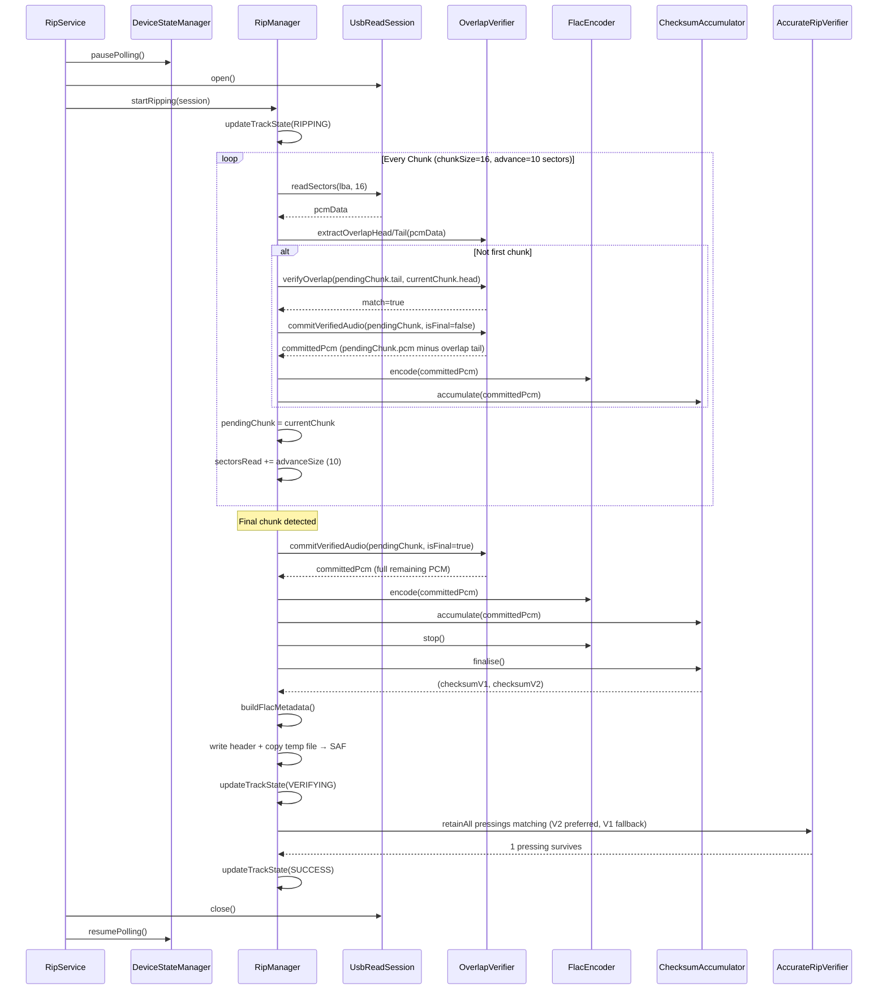
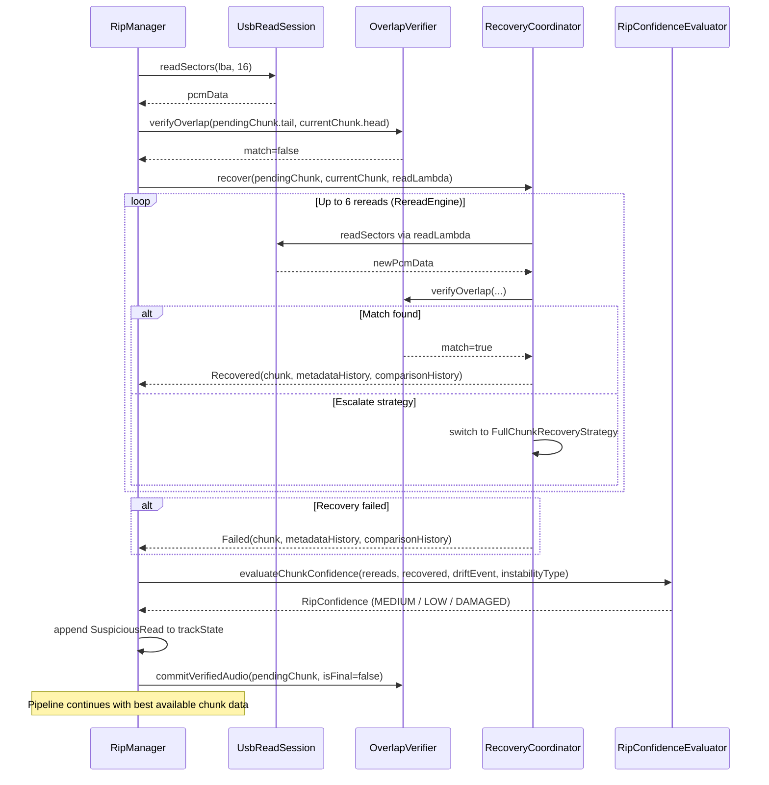
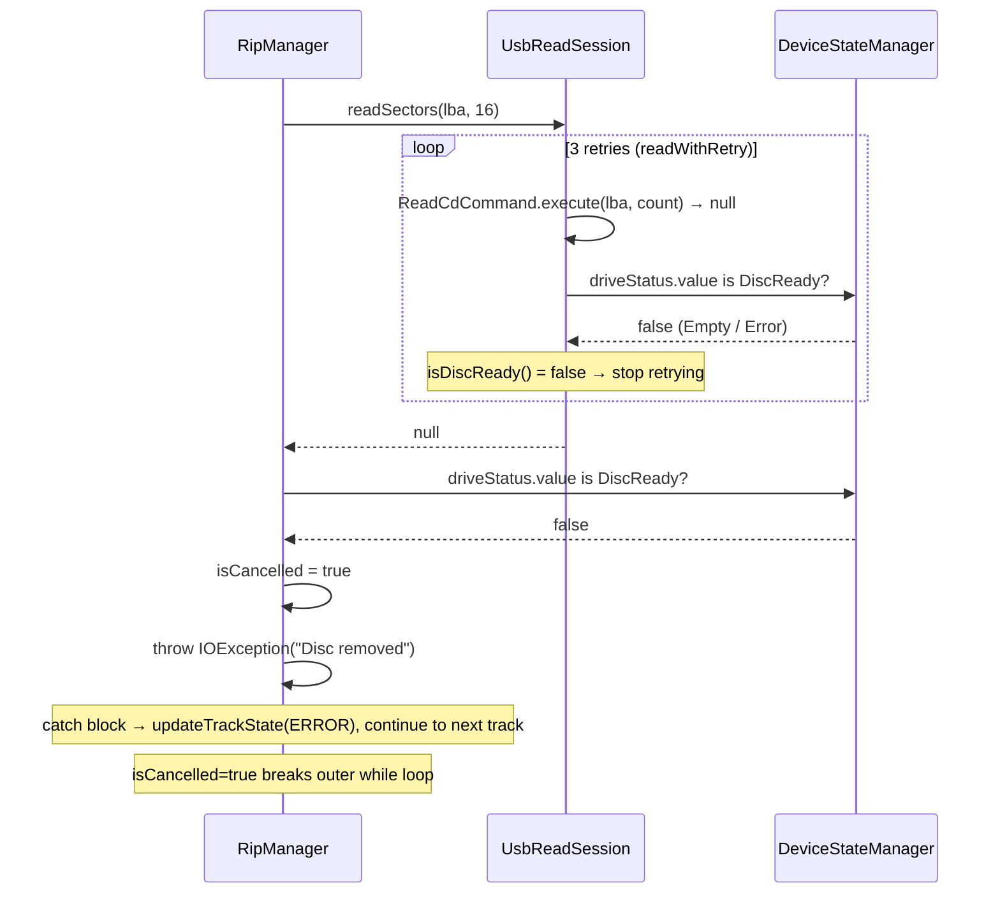

# RipManager Architecture

Accurate as of `RipManager.kt` rev in BitPerfect-main (June 2026).

---

## 1. Overview

`RipManager` is the monolithic orchestrator for the entire CD extraction pipeline. It owns:

- Session-level setup (drive offset, directory creation, forensic logger init, AudioDB fetch)
- A per-track extraction loop (LBA calculation, sector reads, paranoia verification, FLAC encoding)
- Post-extraction work (AccurateRip verification, metadata/artwork/lyrics embedding, JSONL log writing)
- Drive-level teardown (eject on full-disc success)

It is instantiated once per rip session by `RipService`, which also owns the `UsbReadSession` lifecycle (polling pause/resume). `RipManager` receives the open session as a parameter and never touches polling itself.

---

## 2. Constructor Inputs

| Parameter | Type | Purpose |
|---|---|---|
| `context` | `Context` | SAF file I/O, MediaStore scanning |
| `outputFolderUriString` | `String` | Root SAF tree URI for Artist/Album directory creation |
| `toc` | `DiscToc` | Full TOC: track LBAs, pregap offset, lead-out LBA |
| `metadata` | `DiscMetadata` | Artist, album, track titles, disc/total discs, MusicBrainz ID, tags |
| `expectedChecksums` | `List<AccurateRipDiscPressing>` | All known pressings from AccurateRip DB for this disc |
| `artworkBytes` | `ByteArray?` | Cover art (JPEG or PNG) for FLAC PICTURE block |
| `lyricsMap` | `Map<Int, LyricsFetchResult>` | Per-track lyrics (plain + synced LRC) from LRCLIB |
| `driveVendor` / `driveProduct` | `String` | Used for offset lookup and forensic log |
| `initialTracks` | `List<Int>` | Track numbers to rip in this session |
| `previousStates` | `Map<Int, TrackRipState>?` | Preserved states for tracks not being re-ripped (partial re-rip support) |

**Key instance-level state initialised at construction:**

- `_trackStates`: `MutableStateFlow<Map<Int, TrackRipState>>` — the single source of truth for UI. Initialised from `toc.tracks`, optionally merging `previousStates` for tracks not in `initialTracks`.
- `activePressingCandidates`: `MutableSet<AccurateRipDiscPressing>` — starts as a copy of all known pressings; progressively filtered down track-by-track during AccurateRip verification.
- `trackQueue`: `ConcurrentLinkedQueue<Int>` — ordered list of tracks to process.

---

## 3. Public API

```
fun queueTrack(trackNumber: Int)
suspend fun startRipping(session: UsbReadSession)
fun cancel()
fun deleteRipFiles()
val trackStates: StateFlow<Map<Int, TrackRipState>>
var isCancelled: Boolean  (read-only externally)
```

`startRipping` is the entire pipeline — it is a single `suspend fun` that runs until all queued tracks are done, cancelled, or have errored. It is called on `Dispatchers.IO` by `RipService`.

---

## 4. `startRipping` — Top-Level Execution Flow

```
startRipping(session)
├── Resolve drive offset (DriveOffsetRepository)
├── Init DefaultForensicRipLogger, record SessionStarted
├── Resolve SAF parent directory, create Artist/ dir
├── Launch fire-and-forget coroutine: fetch artist.json from AudioDB
├── Create Album/ sub-directory
├── Compute AccurateRip URL
├── Compute tocOffset and sampleOffset from driveOffset
│
├── while (trackQueue.isNotEmpty())
│   └── [Per-track extraction — §5]
│
├── (if !isCancelled) Post-session analysis — §6
└── (if !isCancelled && all tracks terminal) EjectDrive
```

### Drive offset decomposition (lines 216–227)

The raw drive offset in *samples* is split into two components:

- **`tocOffset`** (whole sectors): shifts the physical LBA window. A positive offset means the drive reads slightly ahead; the window starts later. Computed as `driveOffset / 588`, with floor-division correction for negative offsets.
- **`sampleOffset`** (sub-sector samples): the fractional remainder (`driveOffset % 588`). Determines how many bytes (`skipBytes = sampleOffset * 4`) to trim from the first committed PCM of each track, and how many bytes to carry forward via `overreadBuffer` at track boundaries.

---

## 5. Per-Track Extraction Loop

Each iteration of the `while (trackQueue.isNotEmpty())` loop processes one track number. The structure is:

```
Per-track
├── Compute track geometry (entry.lba, nextLba, totalSectors, totalSamples)
├── Build filename, delete any existing file at that path
├── Create SAF destination file
├── Open temp file (cache dir) for FlacEncoder (audio data only, no header)
├── Instantiate per-track objects:
│   ├── ChecksumAccumulator (ARv1/v2)
│   ├── AudioAnalyser (BPM, key, ReplayGain)
│   ├── OverlapVerifier (overlapSizeSectors = 6)
│   ├── RereadEngine (maxRereads = 6)
│   ├── RecoveryCoordinator
│   ├── FastPathEvaluator
│   └── StreamingBehaviorAnalyzer
├── Compute firstLba / lastReadableLba via ripLbaRange()
├── Handle LBA-0 clamp: prepend silence if firstLba was clamped
├── Consume overreadBuffer from previous track (if sampleOffset > 0)
│
├── [Sector read loop — §5.1]
│
├── Overread handling (sampleOffset > 0): read one extra sector at track boundary
│   ├── Non-last track: encode first skipBytes, carry remainder as overreadBuffer
│   └── Last track: encode silence instead, clear overreadBuffer
├── Last-track tocOffset padding: append silence for positive tocOffset
├── Final track alignment validation (alignmentValidator.validateFinalTrack)
├── encoder.stop(), tempOutputStream.close()
├── AudioAnalyser.analyse() → audioAnalysis
├── buildFlacMetadata() → header bytes (STREAMINFO + VORBIS_COMMENT + PICTURE)
├── Open SAF output stream, write header, copy temp file
│
├── [AccurateRip verification — §5.2]
├── writeAccurateRipJsonl()
├── logger.record(TrackCompleted)
│
└── [finally block — §5.3]
```

### 5.1 Sector Read Loop

**Loop invariant:** `sectorsRead < effectiveTotalSectors && !isCancelled`

**Chunk parameters (hardcoded):** `chunkSize = 16`, `overlapSize = 6`, initial `advanceSize = 10`.

Each iteration:

1. **Read** `min(chunkSize, remaining)` sectors via `session.readSectors(readStartLba, sectorsToRead)`.

2. **On null (transport failure):**
   - Record `TRANSPORT_FAILURE` log event.
   - If `driveStatus != DiscReady`: set `isCancelled = true`, throw `IOException` (disc removed path).
   - Otherwise: downgrade confidence to `DAMAGED`, append `SuspiciousRead`, throw `IOException`.

3. **On success:** Wrap in `VerifiedChunk` with overlap head/tail extracted.

4. **Overlap verification** (only when `pendingChunk != null`, i.e. not the first chunk):
   - **Match (`overlapVerifier.verifyOverlap` returns true):**
     - Report match to `fastPathEvaluator`.
     - `committedPcm = overlapVerifier.commitVerifiedAudio(pendingChunk, isFinal = false)` — returns `pendingChunk.pcm` minus the trailing overlap region.
   - **Mismatch:**
     - Report mismatch to `fastPathEvaluator`.
     - Invoke `recoveryCoordinator.recover(previousChunk, failedChunk, readLambda)`.
     - Walk `metadataHistory` from the recovery result: log each escalation, drift event, and targeted recovery window.
     - Build `SuspiciousRead` from final metadata entry (or a blank one if no metadata).
     - Evaluate chunk confidence via `confidenceEvaluator.evaluateChunkConfidence`.
     - Replace `currentChunk` with the recovered chunk (Recovered or Failed — the best available data is used either way).
     - Append `SuspiciousRead` to `trackStates`.
     - `committedPcm = overlapVerifier.commitVerifiedAudio(pendingChunk, isFinal = false)`.

5. **Aggregate track confidence** from chunk confidence.

6. **Sample alignment validation** (when both `committedPcm` and `lastCommittedPcm` are non-null): `alignmentValidator.validateBoundary`. Anomalies (DuplicateSamples, DroppedSamples, InvalidOverlapTrim, BoundaryDiscontinuity) are logged and may further downgrade confidence.

7. **Advance:**
   - `pendingChunk = currentChunk`.
   - If `committedPcm != null`: encode, accumulate checksums, feed analyser. Apply `skipBytes` trim on first sector.
   - Detect final chunk: `(sectorsRead + dynamicAdvance) >= effectiveTotalSectors` or short read. If final: flush `pendingChunk` via `commitVerifiedAudio(isFinal = true)`.
   - Update `sectorsRead`: final chunk advances by `sectorsActuallyRead`; normal chunks advance by `dynamicAdvance` (`pcm.size / 2352 - overlapSizeBytes / 2352`).

8. **Progress update** at end of each iteration.

**Overlap commit semantics:** `commitVerifiedAudio(chunk, isFinal)` returns `chunk.pcm` minus the trailing overlap bytes when `isFinal = false`. When `isFinal = true` it returns the full remaining PCM including the overlap region. This is why `pendingChunk` is always one chunk behind — each chunk is only committed once the *next* chunk has validated the overlap.

### 5.2 AccurateRip Verification

After the sector loop, `checksumAccumulator.finalise()` returns `(finalChecksumV1, finalChecksumV2)`.

The `activePressingCandidates` set is narrowed by `retainAll`: for each pressing, the track entry must match either `crcV2 == finalChecksumV2` (preferred) or `crcV1 == finalChecksumV1`. This is a **cross-track cumulative filter** — a pressing that fails on track 2 is eliminated from consideration for all subsequent tracks, matching EAC's behaviour.

Final status:
- `SUCCESS` — at least one pressing still in `activePressingCandidates`.
- `UNVERIFIED` — no expected checksums exist for this disc in the DB.
- `WARNING` — DB has entries but none matched.

### 5.3 Finally Block

Runs on both success and exception:

1. `encoder?.stop()` (safe — tolerated if already stopped)
2. `tempOutputStream?.close()`
3. `outputStream?.close()` — close exception is captured and re-raised as `ERROR` state after cleanup
4. `tempFile.delete()`
5. If `!ripSucceeded`: `contentResolver.delete(destFile.uri)` — removes the zero-byte or partial SAF file to prevent MediaStore ghost entries.

---

## 6. Post-Session Analysis (lines 1166–1226)

Runs once after all tracks are processed, only if `!isCancelled`.

1. **`DefaultAtomicReadProfiler`**: analyses `ReadSizeMetricsCollector` data across all tracks — preferred read size, max reliable read size, unstable sizes.
2. **Global `StreamingBehaviorAnalyzer`**: analyses all `SequentialReadTelemetry` accumulated across every track.
3. **`DefaultDriveProfiler`**: combines cache probe result (from `SuspiciousRead.cacheProbeResult` of the last suspicious region), streaming analysis, and read size profile into a `DriveProfile`.
4. Log `DriveAnalysisCompleted` and `SessionCompleted`.
5. `logger.finalize(context, albumDir)` — writes the forensic JSONL log to the album directory.
6. If all tracks are `SUCCESS | UNVERIFIED | WARNING`: call `DeviceStateManager.ejectDrive()`.

---

## 7. FLAC File Construction

The temp-file / final-file split exists because FLAC metadata (specifically `STREAMINFO.totalSamples`) must be written before the audio stream, but `totalSamples` is known at track start, not at encoding time. Audio analysis (`BPM`, `ReplayGain`) also runs after encoding completes and its results go into `VORBIS_COMMENT`.

**Write sequence:**
1. Audio frames → `temp_rip_N.flac` via `FlacEncoder` (no FLAC header, raw frames only).
2. `buildFlacMetadata()` → in-memory `ByteArray` containing:
   - `fLaC` marker
   - `STREAMINFO` block (hardcoded 44100 Hz, 16-bit stereo; `totalSamples` from TOC geometry; MD5 zeroed)
   - `VORBIS_COMMENT` block (artist, album, title, track, disc, year, genre, albumArtist, MusicBrainz ID, AccurateRip disc ID, plain lyrics, synced lyrics, BitDepth, SampleRate, BPM, key, ReplayGain, energy, style tags)
   - `PICTURE` block (front cover, if artwork present)
3. Header bytes written to SAF stream first, then temp file contents copied.

**Metadata sanitisation:** `normalizeMeta()` normalises smart quotes and various Unicode dashes to ASCII equivalents before embedding.

---

## 8. Supporting Private Methods

| Method | Purpose |
|---|---|
| `updateTrackState(...)` | Merges partial updates into `_trackStates` using `copy()`. All fields are optional; existing values are preserved for nulls. |
| `buildFlacMetadata(...)` | Constructs the in-memory FLAC header (see §7). |
| `writeAccurateRipJsonl(...)` | Upserts a per-track JSON entry into `BitPerfect.jsonl` in the album directory. Reads existing entries, removes any prior entry for the same disc+track, appends new entry, rewrites the whole file. Triggers MediaStore scan after write. |
| `normalizeMeta(String)` | ASCII normalisation of smart quotes and dashes. |
| `detectMimeType(ByteArray)` | Magic-byte detection for JPEG (`FF D8 FF`) and PNG (`89 50 4E 47`); falls back to `image/jpeg`. |

---

## 9. Sequence Diagrams

### 9.1 Happy Path: Successful Track Extraction

Polling is paused once by `RipService` before `startRipping` is called, and resumed once after it returns. `readSectors` itself does not touch polling.



### 9.2 Overlap Mismatch and Recovery



### 9.3 Transport Failure (Disc Removed)



---

## 10. Known Structural Issues (Pre-Refactor Notes)

These are observations about the current structure, not bugs.

**God class.** `RipManager` performs at least six distinct concerns in a single file: USB I/O orchestration, paranoia recovery coordination, FLAC encoding, AccurateRip verification, SAF file management, and forensic logging. At 1,535 lines it is difficult to test any one concern in isolation.

**FLAC metadata construction in-process.** `buildFlacMetadata` manually assembles FLAC binary blocks (1,140 bytes of byte-twiddling). This belongs in `FlacEncoder` or a dedicated `FlacHeaderBuilder`.

**`writeAccurateRipJsonl` reads and rewrites the entire file on every track.** For a 15-track album this is 15 full read+write cycles on a SAF URI. An append-only approach (rewriting only on completion, or using a proper JSONL append mode) would be simpler.

**Hardcoded `chunkSize` and `overlapSize`.** Both are constants embedded in `startRipping` (lines 323–324). They are referenced in log events and comments elsewhere as if they were configurable. If drive profiling is ever used to adapt read size at runtime, these will need to become parameters.

**`activePressingCandidates` is mutable shared state** across all tracks in the session. The cross-track cumulative filter is intentional (matching EAC behaviour) but is not documented as such at the call site, and makes it impossible to verify tracks independently.

**`isCancelled` is set both externally (`cancel()`) and internally** (on disc-removed IOException path, line 807). The dual write paths are currently safe since both set to `true` only, but they complicate reasoning about cancellation semantics.

**`overreadBuffer` is a mutable `var` in `startRipping`** that carries state across track boundaries. This is the mechanism for sub-sector sample offset correction but is invisible to the caller and untestable without running the whole pipeline.

**Fire-and-forget `launch` for AudioDB fetch** (line 182) has no cancellation handle. If the rip is cancelled, the network request continues running until it completes or times out.
