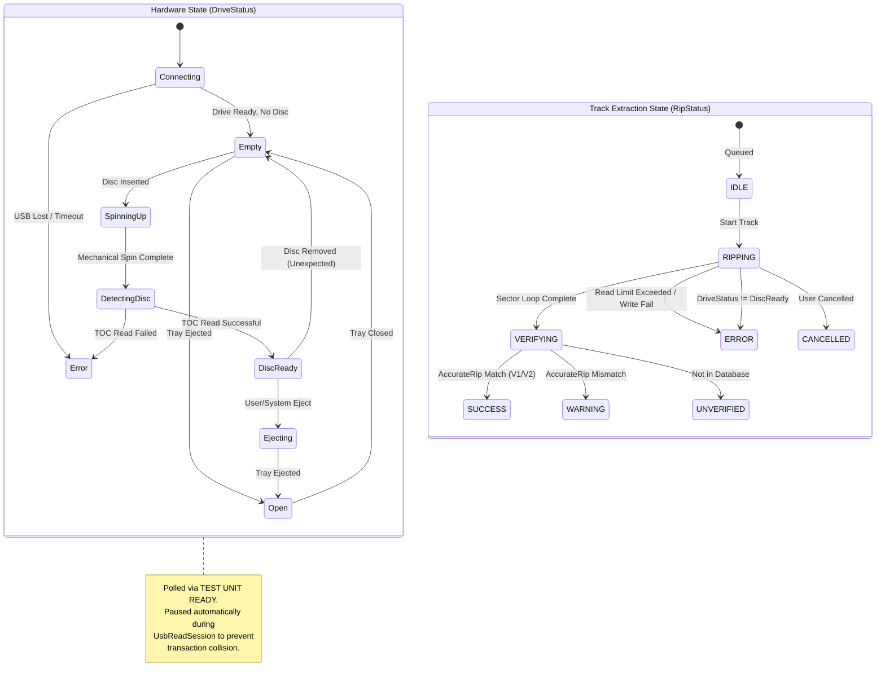
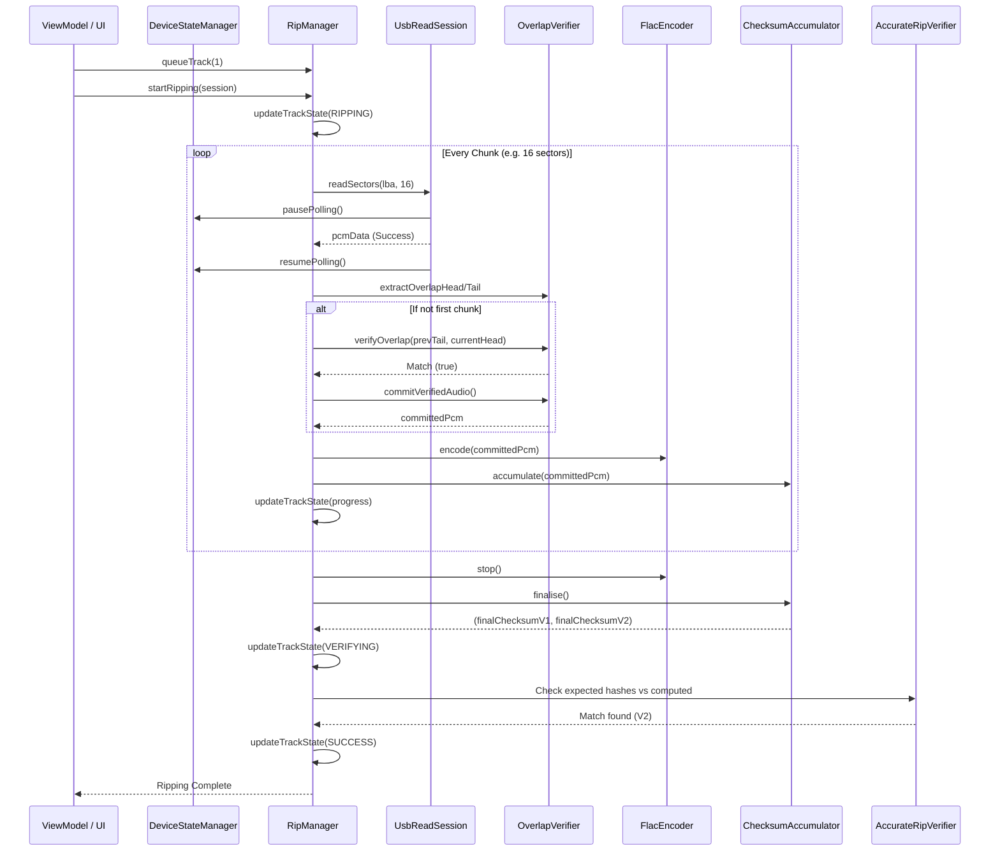
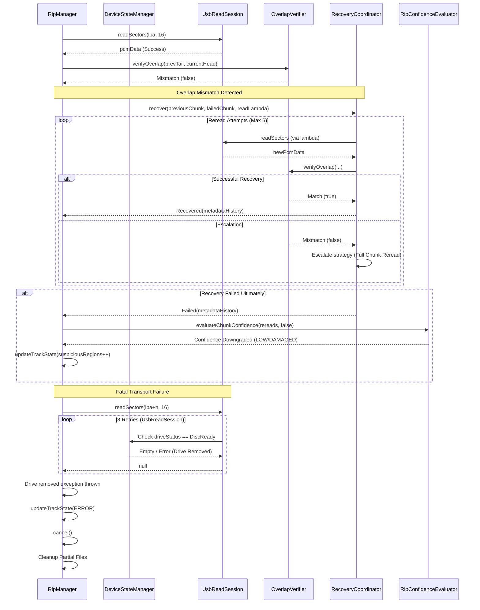

# RipManager and Drive State Architecture

This document outlines the complex interactions between device state management, drive polling, and the secure audio extraction process managed by `RipManager.kt`.

## State Machines

The ripping system operates on two distinct but interrelated state machines:

1.  **Hardware State (`DriveStatus`)**: Managed by `UsbDriveDetector` via `DeviceStateManager`. It polls the USB transport to maintain the physical state of the drive.
2.  **Extraction State (`RipStatus`)**: Managed by `RipManager` (tracking individual `TrackRipState`). It operates on the assumption that the drive is `DiscReady` and aborts if the hardware state changes unexpectedly.

### Combined State Diagram

## Sequence Diagrams

### Happy Path: Successful Track Extraction

This sequence illustrates a flawless track extraction where all sectors are read correctly, overlaps match, and checksums are verified successfully.

### Sad Path: Paranoia Escalation and Hardware Failure

This sequence illustrates what happens when the drive returns short reads, overlaps mismatch, and eventually, the drive is unexpectedly disconnected or cannot recover.

## Component Complexity & Traceability

*   **`UsbDriveDetector`**: Highly complex background daemon. Maintains continuous connection with the SCSI layer using low-level CBW (Command Block Wrapper) testing (TEST UNIT READY).
*   **`DeviceStateManager`**: Singleton registry for the hardware state. Vital for orchestrating the "polling pause" during `UsbReadSession` to prevent command interleaving that crashes the USB bridge.
*   **`RipManager`**: The monolithic orchestrator. It manages:
    *   File I/O (SAF / Temp Files)
    *   Metadata embedding (FlacEncoder)
    *   The Paranoia/Recovery pipeline (`OverlapVerifier`, `RecoveryCoordinator`, `AlignmentValidator`)
    *   AccurateRip state machine verification
    *   Forensic logging (`DefaultForensicRipLogger`)
*   **Paranoia Subsystem**: `RecoveryCoordinator` encapsulates the retry logic (`RereadEngine`) when overlaps fail, determining if a drive is skipping or shifting samples (Read Drift). It feeds this data into the `RipConfidenceEvaluator` to score the rip (HIGH, MEDIUM, LOW, DAMAGED).
