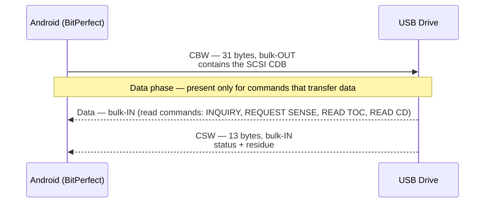
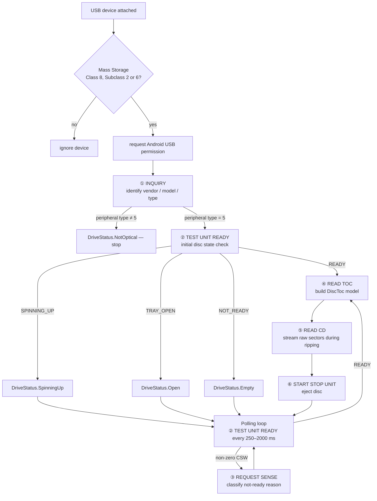
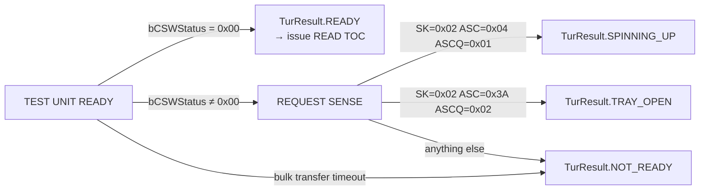
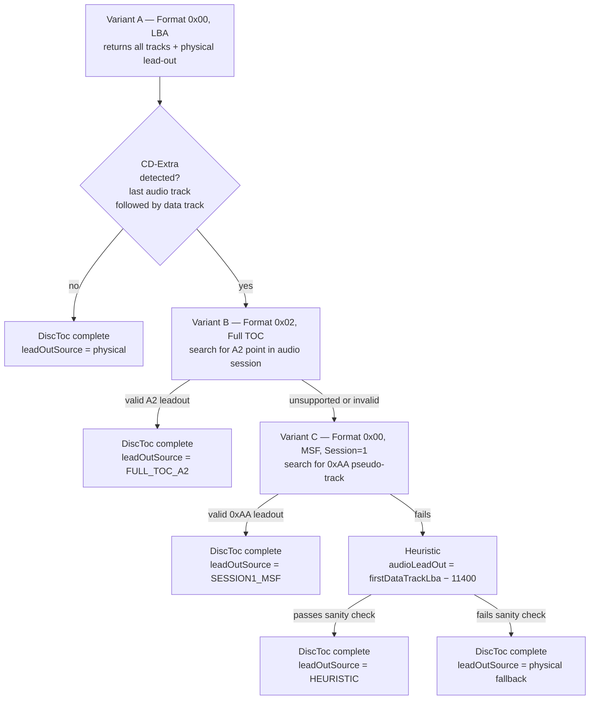
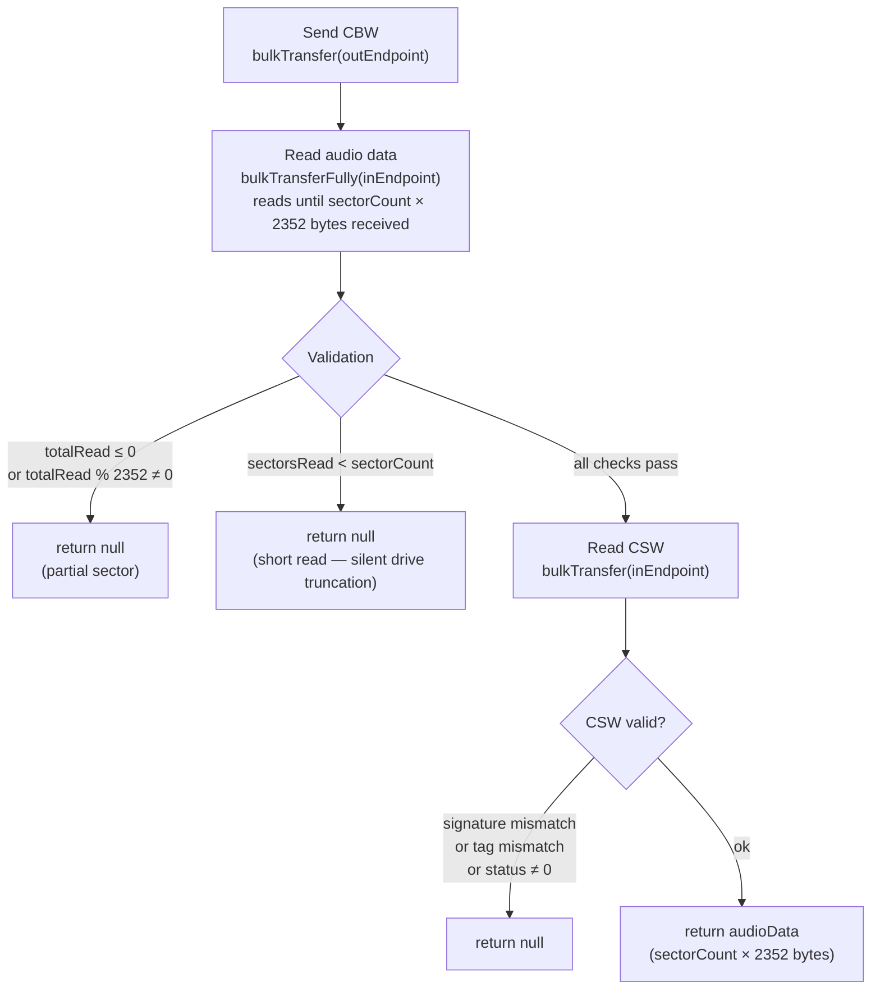
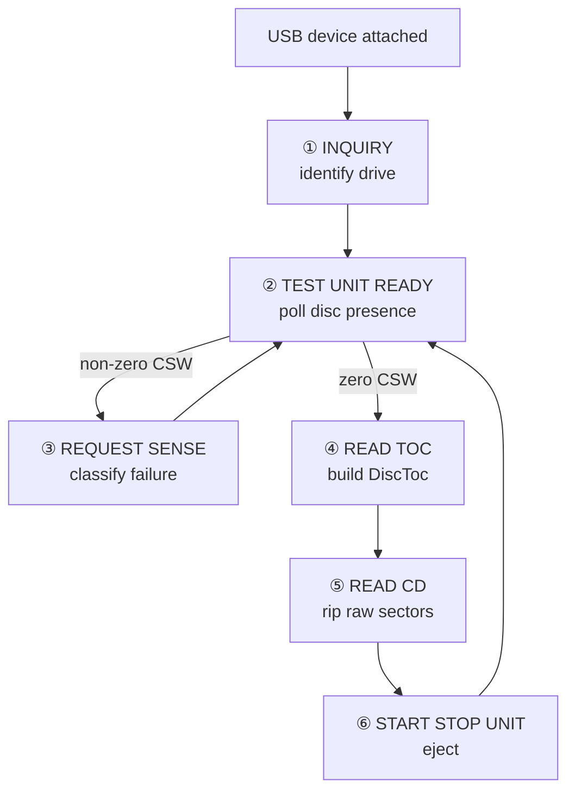

# SCSI/MMC Commands — Technical Reference

BitPerfect communicates with USB optical drives using SCSI commands transmitted over the **USB Mass Storage — Bulk-Only Transport (BOT)** protocol. All commands are from the **MMC-6** (Multi-Media Commands) and **SPC-4** (SCSI Primary Commands) specifications.

Six commands are implemented across four source files:

| Opcode | Command | Spec | Source file |
|---|---|---|---|
| `0x00` | TEST UNIT READY | SPC-4 §6.33 | `UsbDriveDetector.kt` |
| `0x03` | REQUEST SENSE | SPC-4 §6.25 | `UsbDriveDetector.kt` |
| `0x12` | INQUIRY | SPC-4 §6.6 | `ScsiInquiryCommand.kt` |
| `0x1B` | START STOP UNIT | SPC-4 §6.13 | `EjectCommand.kt` |
| `0x43` | READ TOC/PMA/ATIP | MMC-6 §6.26 | `ReadTocCommand.kt` |
| `0xBE` | READ CD | MMC-6 §6.20 | `ReadCdCommand.kt` |

---

## USB Bulk-Only Transport (BOT) Framing

Every SCSI command is wrapped in the same three-phase BOT structure regardless of command type:



### CBW — Command Block Wrapper (31 bytes, little-endian)

```
Bytes  0– 3   dCBWSignature           0x43425355  ("USBC")
Bytes  4– 7   dCBWTag                 unique per-command tag, echoed in CSW
Bytes  8–11   dCBWDataTransferLength  expected byte count in data phase (0 if no data)
Byte  12      bmCBWFlags              0x80 = device→host (IN)
                                      0x00 = host→device or no data phase
Byte  13      bCBWLUN                 logical unit number — always 0
Byte  14      bCBWCBLength            CDB length: 6, 10, or 12 bytes
Bytes 15–30   CBWCB                   SCSI CDB, zero-padded to 16 bytes
```

### CSW — Command Status Wrapper (13 bytes, little-endian)

```
Bytes  0– 3   dCSWSignature     0x53425355  ("USBS")
Bytes  4– 7   dCSWTag           must match dCBWTag
Bytes  8–11   dCSWDataResidue   difference between requested and actual transfer length
Byte  12      bCSWStatus        0x00 = success
                                0x01 = command failed
                                0x02 = phase error
```

BitPerfect validates signature, tag match, and status byte on every CSW. A non-zero status triggers error logging and causes the command to return `null` or `false`. The residue field is read in the Full TOC path to detect short transfers.

---

## Drive Lifecycle and Command Dispatch

The six commands map onto a well-defined drive lifecycle. The flowchart below shows when each is issued:



---

## Command Reference

---

### ① INQUIRY (0x12)

**When used:** Once per device connection during `interrogateDevice()`. Retried up to 5 times with 500 ms backoff before giving up.

**Purpose:** Identifies device type, vendor, model, and firmware. Used to confirm the attached device is a peripheral type 5 (optical drive) before issuing any optical commands, and to populate `DriveInfo` for the UI and offset calibration lookup.

#### CDB (6 bytes)

```
Byte 0   0x12   Opcode: INQUIRY
Byte 1   0x00   EVPD=0 (standard inquiry data, not vital product data page)
Byte 2   0x00   Page Code (ignored when EVPD=0)
Byte 3   0x00   Reserved
Byte 4   0x24   Allocation length = 36 bytes
Byte 5   0x00   Control
```

#### CBW parameters

| Field | Value |
|---|---|
| `dCBWDataTransferLength` | 36 |
| `bmCBWFlags` | `0x80` (IN) |
| `bCBWCBLength` | 6 |

#### Response layout (36 bytes)

```
Byte  0      Peripheral Device Type (bits 4–0)
               5 = optical (CD/DVD/BD)
               0 = direct-access block device (hard drive, flash)
Bytes 1– 7   Qualifier, version, and capability flags — not parsed by BitPerfect
Bytes 8–15   Vendor identification     (8 bytes, ASCII, space-padded) → DriveInfo.vendor
Bytes 16–31  Product identification    (16 bytes, ASCII, space-padded) → DriveInfo.model
Bytes 32–35  Product revision level   (4 bytes, ASCII)                → DriveInfo.firmware
```

`isOptical = (peripheralDeviceType == 5)`. All three string fields are trimmed of whitespace. If the drive is not optical, `DriveStatus.NotOptical` is set and no further SCSI commands are issued.

---

### ② TEST UNIT READY (0x00)

**When used:** Once during initial interrogation; then repeatedly in the background polling loop at 250–2000 ms intervals for the lifetime of the connection.

**Purpose:** The heartbeat of the disc-detection state machine. Asks the drive: "do you have a readable disc right now?" A clean CSW (status `0x00`) means yes. Any failure triggers REQUEST SENSE to determine the specific condition.

#### CDB (6 bytes)

```
Byte 0   0x00   Opcode: TEST UNIT READY
Byte 1   0x00   Reserved
Byte 2   0x00   Reserved
Byte 3   0x00   Reserved
Byte 4   0x00   Reserved
Byte 5   0x00   Control
```

#### CBW parameters

| Field | Value |
|---|---|
| `dCBWDataTransferLength` | 0 |
| `bmCBWFlags` | `0x00` (no data phase) |
| `bCBWCBLength` | 6 |

**No data phase.** The entire result is encoded in `bCSWStatus`. This is the only command in the set with zero bytes transferred in both directions beyond the BOT wrappers.

#### State machine transitions



#### Polling intervals by drive state

| Drive state | Interval | Reason |
|---|---|---|
| `SpinningUp` | 500 ms | Motor engagement — needs frequent checking |
| `DetectingDisc` | 250 ms | Post-spin-up window before disc is readable |
| All others | 2000 ms | Steady-state idle polling |

#### BOT race condition — why polling is paused during ripping

The polling loop is paused via `DeviceStateManager.pausePolling()` for the entire duration of a `UsbReadSession`, and resumed in `UsbReadSession.close()`. If a TEST UNIT READY CBW were sent while a READ CD data phase was in progress, the BOT protocol would be corrupted — the drive would interpret the TUR CBW bytes as audio data, and the TUR CSW might be consumed as the READ CD's CSW. This caused silent data corruption before the session-based pause was introduced.

---

### ③ REQUEST SENSE (0x03)

**When used:** Immediately after TEST UNIT READY returns a non-zero CSW status. Called from `executeRequestSense()` with `tag + 1` to guarantee a unique CBW tag.

**Purpose:** Retrieves the fixed-format sense data that classifies *why* the drive is not ready. BitPerfect only acts on three specific sense code combinations; everything else maps to generic `NOT_READY`.

#### CDB (6 bytes)

```
Byte 0   0x03   Opcode: REQUEST SENSE
Byte 1   0x00   DESC=0 (fixed-format sense data, not descriptor format)
Byte 2   0x00   Reserved
Byte 3   0x00   Reserved
Byte 4   0x12   Allocation length = 18 bytes
Byte 5   0x00   Control
```

#### CBW parameters

| Field | Value |
|---|---|
| `dCBWDataTransferLength` | 18 |
| `bmCBWFlags` | `0x80` (IN) |
| `bCBWCBLength` | 6 |

#### Response layout (18 bytes, fixed-format)

```
Byte  0      Response code (0x70 = current error, fixed format)
Byte  1      Obsolete
Byte  2      Sense Key (bits 3–0)  ← primary error classification
Bytes 3– 6   Information bytes
Byte  7      Additional sense length (n−7, typically 10)
Bytes 8–11   Command-specific information
Byte 12      Additional Sense Code (ASC)   ← secondary classification
Byte 13      Additional Sense Code Qualifier (ASCQ) ← tertiary classification
Bytes 14–17  Field-replaceable unit / sense-key specific
```

#### Sense codes acted on by BitPerfect

| Sense Key | ASC | ASCQ | Meaning | Result |
|---|---|---|---|---|
| `0x02` Not Ready | `0x04` | `0x01` | Logical unit in process of becoming ready | `SPINNING_UP` |
| `0x02` Not Ready | `0x3A` | `0x02` | Medium not present — tray open | `TRAY_OPEN` |
| anything else | — | — | Generic not-ready condition | `NOT_READY` |

---

### ④ READ TOC/PMA/ATIP (0x43)

**When used:** After TEST UNIT READY returns READY, to build the `DiscToc` model consumed by AccurateRip disc ID computation, MusicBrainz lookup, and the ripping pipeline.

**Purpose:** Retrieves the disc Table of Contents — track start LBAs and lead-out. Three variants of the same opcode are used, selected by the Format field in CDB byte 2. They are attempted in sequence based on disc type.

#### CD-Extra leadout resolution strategy



---

#### Variant A — Standard TOC, LBA format (Format 0x00)

Always issued first. Returns every track's LBA and the physical lead-out in binary format.

**CDB (10 bytes):**

```
Byte 0   0x43   Opcode: READ TOC/PMA/ATIP
Byte 1   0x00   MSF=0 — return LBAs, not minute:second:frame values
Byte 2   0x00   Format = 0b0000 (Standard TOC)
Byte 3   0x00   Reserved
Byte 4   0x00   Reserved
Byte 5   0x00   Reserved
Byte 6   0x00   Track/Session Number = 0 (return all tracks)
Byte 7   0x03   Allocation length MSB  ─┐
Byte 8   0x24   Allocation length LSB  ─┘ 804 bytes (0x0324)
Byte 9   0x00   Control
```

**CBW parameters:**

| Field | Value |
|---|---|
| `dCBWDataTransferLength` | 804 |
| `bmCBWFlags` | `0x80` (IN) |
| `bCBWCBLength` | 10 |

**Response structure:**

```
Response header (4 bytes):
  Bytes 0–1   TOC Data Length (big-endian, excludes these 2 bytes)
  Byte  2     First Track Number
  Byte  3     Last Track Number

Per-track descriptor (8 bytes, repeated until TOC Data Length exhausted):
  Byte 0   Reserved
  Byte 1   ADR (bits 7–4) | Control (bits 3–0)
             Control bit 2:  0 = audio track
                             1 = data track
  Byte 2   Track Number
             0x01–0x63 = audio or data track
             0xAA      = lead-out pseudo-track
  Byte 3   Reserved
  Bytes 4–7  Track Start Address (big-endian LBA, 32-bit)
```

**LBA normalisation:** Some drives (including the ASUS SDRW-08D2S-U) return 0-based LBAs with track 1 at LBA 0 rather than the Redbook standard LBA 150. BitPerfect detects this by checking `audioEntries.first().lba == 0` and adds a `pregapOffset` of 150 to all track LBAs and the lead-out. All downstream consumers — AccurateRip disc ID, MusicBrainz TOC, ripping pipeline — expect 150-based offsets.

**CD-Extra detection:** After parsing, if the last entry in `allEntries` is a data track and at least one audio track precedes it, `isCdExtra = true`. The audio tracks are extracted as `audioEntries` and the CD-Extra lead-out resolution chain begins.

---

#### Variant B — Full TOC, MSF format (Format 0x02)

Issued only for CD-Extra discs. Returns detailed session-level descriptors including the A2 point that encodes the audio session lead-out in MSF format.

**CDB (10 bytes):**

```
Byte 0   0x43   Opcode: READ TOC/PMA/ATIP
Byte 1   0x02   MSF=1 — return minute:second:frame values
Byte 2   0x02   Format = 0b0010 (Full TOC)
Byte 3   0x00   Reserved
Byte 4   0x00   Reserved
Byte 5   0x00   Reserved
Byte 6   0x00   Session Number = 0 (all sessions)
Byte 7   0x08   Allocation length MSB  ─┐
Byte 8   0x00   Allocation length LSB  ─┘ 2048 bytes (0x0800)
Byte 9   0x00   Control
```

**CBW parameters:**

| Field | Value |
|---|---|
| `dCBWDataTransferLength` | 2048 |
| `bmCBWFlags` | `0x80` (IN) |
| `bCBWCBLength` | 10 |

**Per-descriptor (11 bytes):**

```
Byte  0   Session Number
Byte  1   ADR (bits 7–4) | Control (bits 3–0)
Byte  2   TNO — track number (0 for A-mode sub-entries)
Byte  3   POINT — identifies the entry type:
            0x01–0x63 = track start address
            0xA0      = first track in session
            0xA1      = last track in session
            0xA2      = session lead-out address  ← target
Bytes 4–6  HMSF — MSF of this entry (not used)
Byte  7    Zero
Byte  8    PMIN   ─┐ MSF address of the POINT
Byte  9    PSEC   ─┤
Byte 10    PFRAME─┘
```

**Parsing strategy:**

1. First pass: collect `audioSessions` — all session numbers where at least one POINT 0x01–0x63 entry has `control bit 2 == 0` (audio track).
2. `targetSession = audioSessions.maxOrNull()` — highest-numbered audio session.
3. Second pass: find the descriptor where `session == targetSession` and `POINT == 0xA2`.
4. Convert: `lba = ((PMIN × 60) + PSEC) × 75 + PFRAME`, then add `pregapOffset`.
5. Sanity-check: `lba > lastAudioTrackLba` and `lba < physicalLeadOutLba`.

---

#### Variant C — Standard TOC, MSF format, Session 1 (Format 0x00, Session=1)

Fallback when Variant B is unsupported or returns an invalid result. Requests only session 1's track list using MSF addresses.

**CDB (10 bytes):**

```
Byte 0   0x43   Opcode: READ TOC/PMA/ATIP
Byte 1   0x02   MSF=1
Byte 2   0x00   Format = 0b0000 (Standard TOC)
Byte 3   0x00   Reserved
Byte 4   0x00   Reserved
Byte 5   0x00   Reserved
Byte 6   0x01   Session Number = 1 (audio session only)
Byte 7   0x08   Allocation length MSB  ─┐
Byte 8   0x00   Allocation length LSB  ─┘ 2048 bytes
Byte 9   0x00   Control
```

**CBW parameters:**

| Field | Value |
|---|---|
| `dCBWDataTransferLength` | 2048 |
| `bmCBWFlags` | `0x80` (IN) |
| `bCBWCBLength` | 10 |

Uses the same 8-byte descriptor structure as Variant A but with MSF values at bytes 4–6 instead of a 32-bit LBA at bytes 4–7. Searches for `trackNumber == 0xAA` (lead-out pseudo-track), validates `sec < 60 && frame < 75` to reject malformed MSF values, then converts to LBA and applies the same sanity checks as Variant B.

---

### ⑤ READ CD (0xBE)

**When used:** For every sector or group of sectors during ripping, called from `RipManager` via `UsbReadSession.readSectors()`. Up to 3 retries per sector group before marking the track as failed.

**Purpose:** Extracts raw 2352-byte CDDA sectors. Byte 9 flags request user data only — no sync, no header, no ECC — which for audio sectors returns the entire 2352 bytes of raw 16-bit stereo PCM.

#### CDB (12 bytes)

```
Byte  0   0xBE   Opcode: READ CD
Byte  1   0x00   Expected Sector Type = 0 (any type — no type enforcement)
Bytes 2–5        Starting LBA (big-endian, 32-bit)
Bytes 6–8        Transfer length in sectors (big-endian, 24-bit)
Byte  9   0x10   Main channel selection flags (see bit breakdown below)
Byte 10   0x00   Sub-channel data format = 0x00 (no subchannel)
Byte 11   0x00   Reserved
```

#### CBW parameters

| Field | Value |
|---|---|
| `dCBWDataTransferLength` | `sectorCount × 2352` |
| `bmCBWFlags` | `0x80` (IN) |
| `bCBWCBLength` | 12 |

#### Byte 9 — main channel selection flags

```
Bit 7    Sync field        0 = exclude
Bits 6–5 Header fields     00 = exclude
Bit 4    User Data         1 = include  ← selects the 2352 raw audio bytes
Bit 3    EDC/ECC           0 = exclude
Bits 2–1 C2 Error Info     00 = none
Bit 0    Reserved

0x10 = 0b00010000
```

For CDDA sectors the "user data" field covers all 2352 bytes — the full audio payload. There is no separate sync or ECC for audio sectors, so `0x10` is equivalent to requesting the complete sector.

#### Data phase — bulk transfer handling



`bulkTransferFully` is used instead of the single-call `bulkTransfer` because USB full-speed packet fragmentation splits large transfers across many 512-byte packets. A single `bulkTransfer` call would return after the first packet and silently truncate the audio data. `bulkTransferFully` loops until the full byte count is received or a hard failure occurs.

A truncated response that is a whole number of sectors but fewer than requested is also rejected — this catches drives that honour partial requests without setting an error in the CSW.

#### Sector geometry

```
1 sector = 2352 bytes = 588 stereo sample frames
1 sample frame = 4 bytes (2 bytes left channel + 2 bytes right channel, 16-bit signed LE)
1 second = 75 sectors = 44,100 sample frames
```

---

### ⑥ START STOP UNIT (0x1B) — Eject

**When used:** When the user taps the eject button in the UI, or automatically after a completed rip where the post-rip warning flow has been confirmed.

**Purpose:** Stops the spindle motor and opens the disc tray.

#### CDB (6 bytes)

```
Byte 0   0x1B   Opcode: START STOP UNIT
Byte 1   0x00   IMMED=0 — wait for mechanical completion before returning CSW
Byte 2   0x00   Reserved
Byte 3   0x00   Reserved
Byte 4   0x02   Power Condition (bits 7–4) = 0x0
                LoEj (bit 1) = 1
                Start (bit 0) = 0
                → LoEj=1, Start=0: eject (open tray)
Byte 5   0x00   Control
```

All four combinations of LoEj and Start for reference:

| LoEj | Start | Byte 4 | Effect |
|---|---|---|---|
| 0 | 0 | `0x00` | Stop spindle |
| 0 | 1 | `0x01` | Start spindle |
| 1 | 0 | `0x02` | Eject (open tray) ← **BitPerfect** |
| 1 | 1 | `0x03` | Load (close tray) |

#### CBW parameters

| Field | Value |
|---|---|
| `dCBWDataTransferLength` | 0 |
| `bmCBWFlags` | `0x00` (no data phase) |
| `bCBWCBLength` | 6 |

No data phase. Result is entirely in `bCSWStatus`.

---

## Command Interaction Map



---

## Quick Reference — All CDBs

| Command | B0 | B1 | B2 | B3 | B4 | B5 | B6 | B7 | B8 | B9 | B10 | B11 |
|---|---|---|---|---|---|---|---|---|---|---|---|---|
| INQUIRY | `12` | `00` | `00` | `00` | `24` | `00` | | | | | | |
| TEST UNIT READY | `00` | `00` | `00` | `00` | `00` | `00` | | | | | | |
| REQUEST SENSE | `03` | `00` | `00` | `00` | `12` | `00` | | | | | | |
| START STOP UNIT | `1B` | `00` | `00` | `00` | `02` | `00` | | | | | | |
| READ TOC (A) | `43` | `00` | `00` | `00` | `00` | `00` | `00` | `03` | `24` | `00` | | |
| READ TOC (B) | `43` | `02` | `02` | `00` | `00` | `00` | `00` | `08` | `00` | `00` | | |
| READ TOC (C) | `43` | `02` | `00` | `00` | `00` | `00` | `01` | `08` | `00` | `00` | | |
| READ CD | `BE` | `00` | LBA | LBA | LBA | LBA | LEN | LEN | LEN | `10` | `00` | `00` |

---

## Byte 9 READ CD Flag Reference

BitPerfect uses `0x10` exclusively. Other values shown for context:

| Byte 9 | User Data | Sync | Header | EDC/ECC | Notes |
|---|---|---|---|---|---|
| `0x10` | ✓ | ✗ | ✗ | ✗ | **BitPerfect — audio user data only** |
| `0xF8` | ✓ | ✓ | ✓ | ✓ | Full raw sector (Mode 1 data) |
| `0x10` + sub `0x01` | ✓ | ✗ | ✗ | ✗ | Audio + raw P–W subchannel (used by some rippers for offset scanning) |

---

## Known Issues & Notes

**TEST UNIT READY timeout vs disconnect:** A `bulkTransfer` timeout on the CBW or CSW is returned as `TurResult.NOT_READY`, not `CONNECTION_DEAD`. A genuine USB disconnect is detected later when the BOT signature validation receives an all-zero buffer — at that point `CONNECTION_DEAD` is returned and a silent reconnect sequence begins with exponential backoff (500 ms, 1 s, 1.5 s, 2 s, 2.5 s, up to 5 attempts).

**READ CD byte 1 — Expected Sector Type = 0:** Setting this to `0x04` (CDDA) would be more precise, but firmware-locked consumer drives commonly reject type-specific READ CD requests. Type 0 (any) is the universal safe value.

**No MODE SENSE (0x5A) / MODE SELECT (0x55):** BitPerfect does not query or configure drive capabilities or read speed. Drive speed is left at firmware defaults. This is a known limitation: riplock firmware on drives such as the ASUS SDRW-08D2S-U caps audio extraction at approximately 2× regardless of software requests. Only a firmware modification can lift this restriction — there is no SCSI command that bypasses it.

**No PREVENT ALLOW MEDIUM REMOVAL (0x1E):** BitPerfect does not lock the tray during ripping. A user pressing the physical eject button mid-rip will succeed at the hardware level. The post-rip warning flow that holds the user on the rip screen until disc ejection is confirmed is entirely software-side; it cannot prevent a forced hardware eject.
