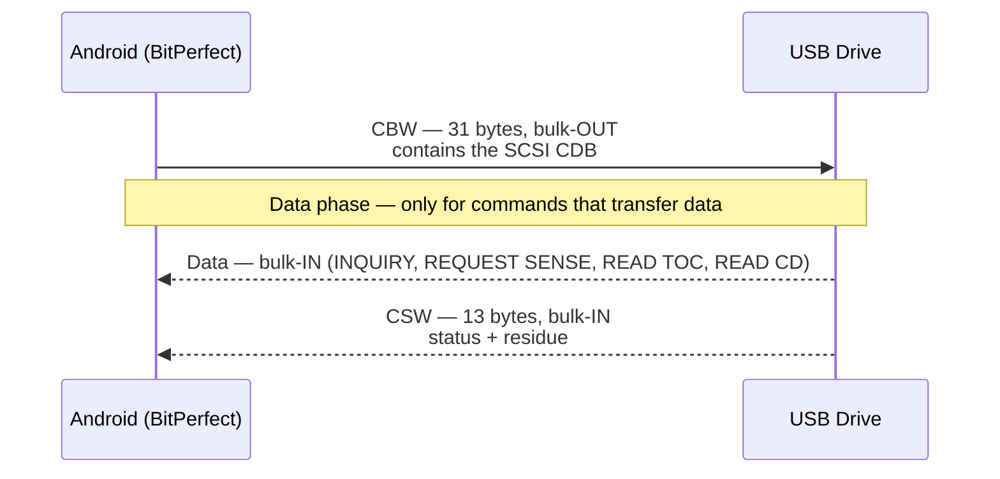
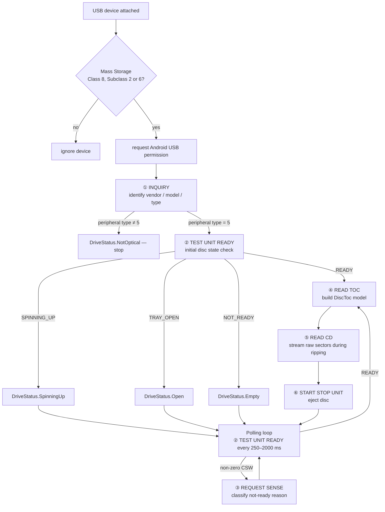
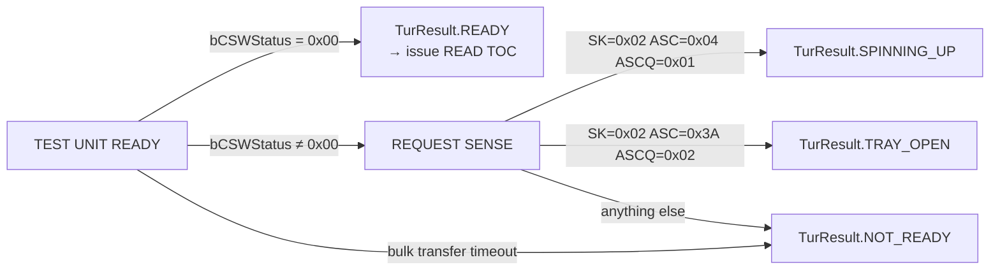
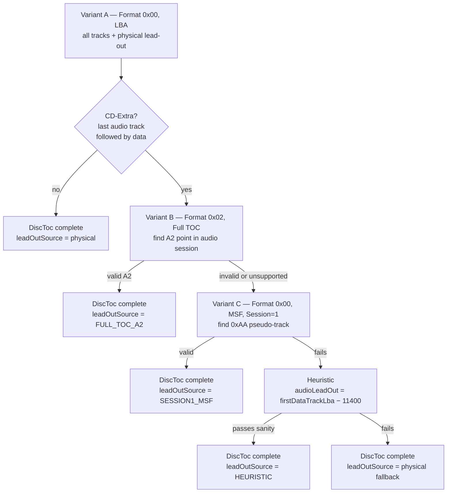
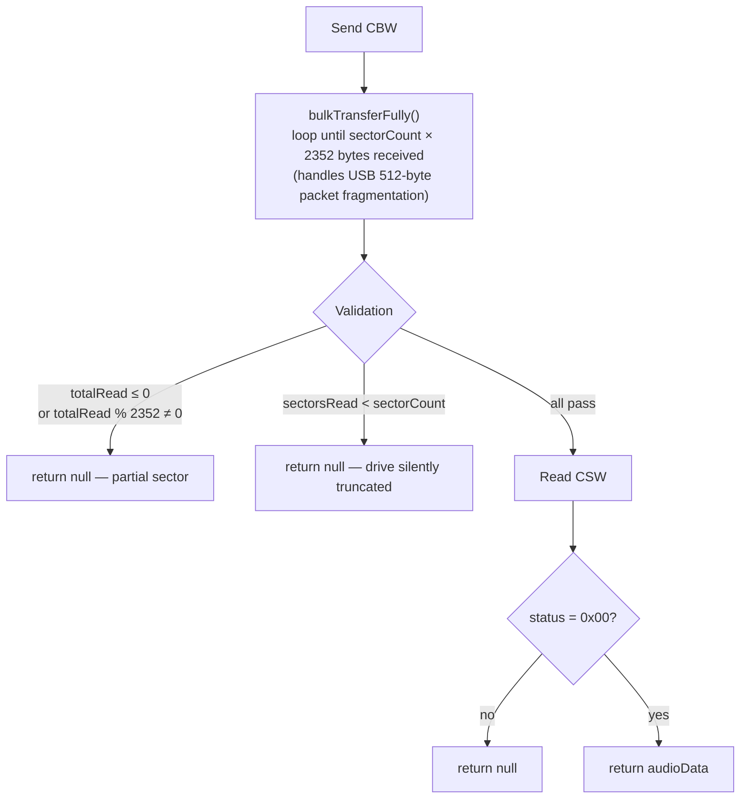
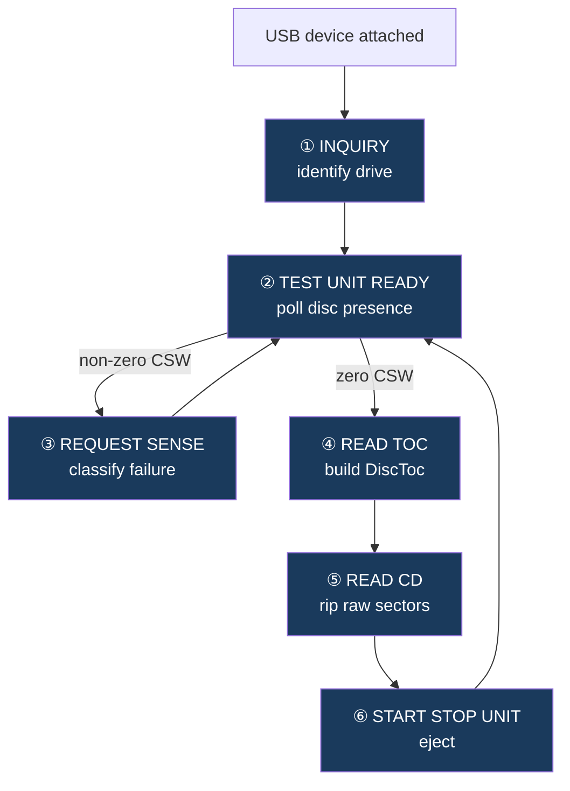

# SCSI/MMC Commands — Technical Reference

BitPerfect communicates with USB optical drives using SCSI commands transmitted over the **USB Mass Storage — Bulk-Only Transport (BOT)** protocol. All commands are from the **MMC-6** (Multi-Media Commands) and **SPC-4** (SCSI Primary Commands) specifications. References verified against libcdio 2.1.0, and the Linux kernel `linux/cdrom.h` and `scsi/scsi.h` headers.

## Command Inventory

### Implemented

| Opcode | Command | Spec | Source file | libcdio equivalent |
|---|---|---|---|---|
| `0x00` | TEST UNIT READY | SPC-4 §6.33 | `UsbDriveDetector.kt` | `mmc_run_cmd(TEST_UNIT_READY)` |
| `0x03` | REQUEST SENSE | SPC-4 §6.25 | `UsbDriveDetector.kt` | `mmc_get_drive_cap()` |
| `0x12` | INQUIRY | SPC-4 §6.6 | `ScsiInquiryCommand.kt` | `mmc_run_cmd(INQUIRY)` |
| `0x1B` | START STOP UNIT | SPC-4 §6.13 | `EjectCommand.kt` | `mmc_eject_media()` |
| `0x43` | READ TOC/PMA/ATIP | MMC-6 §6.26 | `ReadTocCommand.kt` | `mmc_get_toc()` / `mmc_get_raw_toc()` |
| `0xBE` | READ CD | MMC-6 §6.20 | `ReadCdCommand.kt` | `mmc_read_audio_sectors()` |

### Not implemented — gaps and design decisions

| Opcode | Command | Status |
|---|---|---|
| `0x1E` | PREVENT ALLOW MEDIUM REMOVAL | ⚠️ Gap — tray not locked during ripping |
| `0x46` | GET CONFIGURATION | ⚠️ Gap — C2 capability never checked before READ CD |
| `0x5A` | MODE SENSE (10) | ⚠️ Gap — capability detection relies on try/fail not query |
| `0xBB` | SET CD SPEED | ⚠️ Not implemented — effect on ASUS drive untested; may or may not be the cause of ~2× cap |
| `0x42` | READ SUB-CHANNEL | ✅ By design — MusicBrainz replaces subchannel metadata |
| `0x4A` | GET EVENT STATUS NOTIFICATION | ✅ By design — TUR polling more reliable over USB BOT |
| `0x55` | MODE SELECT (10) | ✅ By design — no write/config operations needed |
| `0x28` | READ (10) | ✅ By design — data tracks never read |

---

## USB Bulk-Only Transport (BOT) Framing

Every SCSI command follows the same three-phase BOT structure:



### CBW — Command Block Wrapper (31 bytes, little-endian)

```
Bytes  0– 3   dCBWSignature           0x43425355  ("USBC")
Bytes  4– 7   dCBWTag                 unique per-command tag, echoed in CSW
Bytes  8–11   dCBWDataTransferLength  expected byte count in data phase (0 if no data)
Byte  12      bmCBWFlags              0x80 = device→host (IN)
                                      0x00 = host→device or no data phase
Byte  13      bCBWLUN                 logical unit number — always 0
Byte  14      bCBWCBLength            CDB length: 6, 10, or 12 bytes
Bytes 15–30   CBWCB                   SCSI CDB, zero-padded to 16 bytes
```

### CSW — Command Status Wrapper (13 bytes, little-endian)

```
Bytes  0– 3   dCSWSignature     0x53425355  ("USBS")
Bytes  4– 7   dCSWTag           must match dCBWTag
Bytes  8–11   dCSWDataResidue   difference between requested and actual transfer length
Byte  12      bCSWStatus        0x00 = success
                                0x01 = command failed
                                0x02 = phase error
```

BitPerfect validates signature, tag match, and status on every CSW. A non-zero status triggers error logging and returns `null` or `false`. The residue field is read in the Full TOC path to detect short transfers.

---

## Drive Lifecycle and Command Dispatch



---

## Command Reference

---

### ① INQUIRY (0x12)

**Spec:** SPC-4 §6.6 | **File:** `ScsiInquiryCommand.kt` | **libcdio:** byte-perfect match ✅

**When used:** Once per device connection during `interrogateDevice()`. Retried up to 5 times with 500 ms backoff.

**Purpose:** Identifies device type, vendor, model, and firmware. Confirms the device is peripheral type 5 (optical drive) before any optical commands are issued.

#### CDB (6 bytes)

```
Byte 0   0x12   Opcode: INQUIRY
Byte 1   0x00   EVPD=0 (standard inquiry, not vital product data)
Byte 2   0x00   Page Code (ignored when EVPD=0)
Byte 3   0x00   Reserved
Byte 4   0x24   Allocation length = 36 bytes
Byte 5   0x00   Control
```

#### CBW parameters

| Field | Value |
|---|---|
| `dCBWDataTransferLength` | 36 |
| `bmCBWFlags` | `0x80` (IN) |
| `bCBWCBLength` | 6 |

#### Response layout (36 bytes)

```
Byte  0      Peripheral Device Type (bits 4–0)
               5 = optical (CD/DVD)    ← BitPerfect checks for this
               0 = direct-access (HDD/flash)
Bytes 1– 7   Qualifier and capability flags — not parsed
Bytes 8–15   Vendor identification     (8 bytes ASCII, space-padded) → DriveInfo.vendor
Bytes 16–31  Product identification    (16 bytes ASCII, space-padded) → DriveInfo.model
Bytes 32–35  Product revision level   (4 bytes ASCII)                → DriveInfo.firmware
```

---

### ② TEST UNIT READY (0x00)

**Spec:** SPC-4 §6.33 | **File:** `UsbDriveDetector.kt` | **libcdio:** byte-perfect match ✅

**When used:** Once during initial interrogation; then continuously in the polling loop for the lifetime of the connection.

**Purpose:** The heartbeat of the disc-detection state machine. A zero CSW status means the drive has a readable disc. Any failure triggers REQUEST SENSE.

#### CDB (6 bytes)

```
Byte 0   0x00   Opcode: TEST UNIT READY
Byte 1   0x00   Reserved
Byte 2   0x00   Reserved
Byte 3   0x00   Reserved
Byte 4   0x00   Reserved
Byte 5   0x00   Control
```

#### CBW parameters

| Field | Value |
|---|---|
| `dCBWDataTransferLength` | 0 |
| `bmCBWFlags` | `0x00` (no data phase) |
| `bCBWCBLength` | 6 |

No data phase. The entire result is in `bCSWStatus`.

#### State machine transitions



#### Polling intervals

| Drive state | Interval |
|---|---|
| `SpinningUp` | 500 ms |
| `DetectingDisc` | 250 ms |
| All others | 2000 ms |

#### BOT race condition

The polling loop is paused for the entire duration of a `UsbReadSession` and resumed in `UsbReadSession.close()`. If a TEST UNIT READY CBW were sent while a READ CD data phase was in progress, the BOT protocol would be corrupted — the TUR CBW bytes would be interpreted as audio data, or the TUR CSW consumed as the READ CD's CSW. This caused silent data corruption before the session-based pause was introduced.

---

### ③ REQUEST SENSE (0x03)

**Spec:** SPC-4 §6.25 | **File:** `UsbDriveDetector.kt` | **libcdio:** CDB match ✅, sense coverage partial ⚠️

**When used:** Immediately after TEST UNIT READY returns non-zero CSW status. Uses `tag + 1` to guarantee a unique CBW tag.

**Purpose:** Retrieves fixed-format sense data classifying why the drive is not ready.

#### CDB (6 bytes)

```
Byte 0   0x03   Opcode: REQUEST SENSE
Byte 1   0x00   DESC=0 (fixed-format sense data)
Byte 2   0x00   Reserved
Byte 3   0x00   Reserved
Byte 4   0x12   Allocation length = 18 bytes
Byte 5   0x00   Control
```

#### CBW parameters

| Field | Value |
|---|---|
| `dCBWDataTransferLength` | 18 |
| `bmCBWFlags` | `0x80` (IN) |
| `bCBWCBLength` | 6 |

#### Response layout (18 bytes, fixed-format)

```
Byte  0      Response code (0x70 = current error, fixed format)
Byte  1      Obsolete
Byte  2      Sense Key (bits 3–0)
Bytes 3– 6   Information bytes
Byte  7      Additional sense length
Bytes 8–11   Command-specific information
Byte 12      Additional Sense Code (ASC)
Byte 13      Additional Sense Code Qualifier (ASCQ)
Bytes 14–17  Field-replaceable unit / sense-key specific
```

#### Sense codes — BitPerfect vs libcdio

| SK | ASC | ASCQ | Meaning | BitPerfect | libcdio |
|---|---|---|---|---|---|
| `0x02` | `0x04` | `0x01` | LU becoming ready (spin-up) | `SPINNING_UP` ✅ | handled |
| `0x02` | `0x04` | `0x02` | LU needs initializing command | `NOT_READY` ⚠️ | handled separately |
| `0x02` | `0x3A` | `0x00` | Medium not present (generic) | `NOT_READY` ⚠️ | `TRAY_OPEN` |
| `0x02` | `0x3A` | `0x01` | Medium not present, tray closed | `NOT_READY` ⚠️ | `TRAY_OPEN` |
| `0x02` | `0x3A` | `0x02` | Medium not present, tray open | `TRAY_OPEN` ✅ | `TRAY_OPEN` |
| `0x06` | `0x28` | `0x00` | Unit Attention — medium changed | `NOT_READY` ⚠️ | triggers TOC re-read |
| `0x06` | `0x29` | `0x00` | Unit Attention — power on/reset | `NOT_READY` ⚠️ | triggers re-init |

**Gap — ASC=0x3A ASCQ=0x00/0x01:** Drives that report the generic or tray-closed medium-absent variant are shown as `Empty` rather than `Open` in the UI, and poll at 2000 ms rather than being tray-aware. No data integrity risk but wrong state label and slower detection.

**Gap — SK=0x06 Unit Attention:** A hot-swap disc change, power cycle, or device reset produces Unit Attention. BitPerfect maps this to `NOT_READY` and eventually detects the new disc via polling, but libcdio uses it as a signal to re-read the TOC immediately. No data loss, but slower to respond to disc changes.

**Recommended fix for ASC=0x3A:**
```kotlin
// Match any ASCQ for medium-not-present:
0x3A -> TurResult.TRAY_OPEN   // instead of only matching ASCQ=0x02
```

---

### ④ READ TOC/PMA/ATIP (0x43)

**Spec:** MMC-6 §6.26 | **File:** `ReadTocCommand.kt` | **libcdio:** all three variants correct ✅

**When used:** After TEST UNIT READY returns READY, to build the `DiscToc` model used by AccurateRip, MusicBrainz, and the ripping pipeline.

#### CD-Extra leadout resolution strategy



#### Variant A — Standard TOC, LBA (Format 0x00)

Always issued first. Returns every track's LBA and the physical lead-out.

**CDB (10 bytes):**

```
Byte 0   0x43   Opcode: READ TOC/PMA/ATIP
Byte 1   0x00   MSF=0 — return LBAs
Byte 2   0x00   Format = 0b0000 (Standard TOC)
Byte 3   0x00   Reserved
Byte 4   0x00   Reserved
Byte 5   0x00   Reserved
Byte 6   0x00   Track/Session Number = 0 (all tracks)
Byte 7   0x03   Allocation length MSB  ─┐ 804 = 4 header + 100×8 descriptors
Byte 8   0x24   Allocation length LSB  ─┘ (99 Red Book tracks + 1 lead-out = 100 max)
Byte 9   0x00   Control
```

**CBW parameters:**

| Field | Value |
|---|---|
| `dCBWDataTransferLength` | 804 |
| `bmCBWFlags` | `0x80` (IN) |
| `bCBWCBLength` | 10 |

**Response — header (4 bytes) + per-track descriptors (8 bytes each):**

```
Header:
  Bytes 0–1   TOC Data Length (big-endian, excludes these 2 bytes)
  Byte  2     First Track Number
  Byte  3     Last Track Number

Per-track descriptor (8 bytes):
  Byte 0   Reserved
  Byte 1   ADR (bits 7–4) | Control (bits 3–0)
             Control bit 2:  0 = audio track
                             1 = data track
  Byte 2   Track Number (0xAA = lead-out pseudo-track)
  Byte 3   Reserved
  Bytes 4–7  Track Start Address (big-endian LBA)
```

**LBA normalisation:** Some drives (including the ASUS SDRW-08D2S-U) return 0-based LBAs with track 1 at LBA 0 instead of the Redbook standard LBA 150. BitPerfect detects `audioEntries.first().lba == 0` and adds `pregapOffset = 150` to all track LBAs and the lead-out. All downstream consumers expect 150-based offsets.

---

#### Variant B — Full TOC, MSF (Format 0x02)

Issued only for CD-Extra. Returns session-level descriptors including the A2 point encoding the audio session lead-out.

**CDB (10 bytes):**

```
Byte 0   0x43   Opcode: READ TOC/PMA/ATIP
Byte 1   0x02   MSF=1
Byte 2   0x02   Format = 0b0010 (Full TOC)
Byte 3   0x00   Reserved
Byte 4   0x00   Reserved
Byte 5   0x00   Reserved
Byte 6   0x00   Session Number = 0 (all sessions)
Byte 7   0x08   Allocation length MSB  ─┐ 2048 bytes
Byte 8   0x00   Allocation length LSB  ─┘ (~185 descriptors at 11 bytes each)
Byte 9   0x00   Control
```

**CBW parameters:**

| Field | Value |
|---|---|
| `dCBWDataTransferLength` | 2048 |
| `bmCBWFlags` | `0x80` (IN) |
| `bCBWCBLength` | 10 |

**Per-descriptor (11 bytes):**

```
Byte  0   Session Number
Byte  1   ADR | Control
Byte  2   TNO (track number; 0 for A-mode entries)
Byte  3   POINT:  0x01–0x63 = track
                  0xA0 = first track in session
                  0xA1 = last track in session
                  0xA2 = session lead-out address  ← target
Bytes 4–6  HMSF of this entry (not used)
Byte  7    Zero
Byte  8    PMIN   ─┐ MSF of the POINT
Byte  9    PSEC   ─┤
Byte 10    PFRAME ─┘
```

**Parsing:** Find highest-numbered audio session → locate its 0xA2 descriptor → convert MSF to LBA → sanity-check `lba > lastAudioTrackLba && lba < physicalLeadOutLba`.

> **libcdio note:** libcdio requests `0xFFFF` bytes for the Full TOC rather than 2048. 2048 accommodates ~185 descriptors — no real-world disc comes close — but changing to `0xFFFF` would fully align with the reference.

---

#### Variant C — Standard TOC, MSF, Session 1 (Format 0x00, Session=1)

Fallback when Variant B fails. Requests session 1 only with MSF addresses.

**CDB (10 bytes):**

```
Byte 0   0x43   Opcode: READ TOC/PMA/ATIP
Byte 1   0x02   MSF=1
Byte 2   0x00   Format = 0b0000 (Standard TOC)
Byte 3   0x00   Reserved
Byte 4   0x00   Reserved
Byte 5   0x00   Reserved
Byte 6   0x01   Session Number = 1 (audio session only)
Byte 7   0x08   Allocation length MSB  ─┐ 2048 bytes
Byte 8   0x00   Allocation length LSB  ─┘
Byte 9   0x00   Control
```

Same 8-byte descriptor structure as Variant A but with MSF at bytes 4–6. Searches for `trackNumber == 0xAA`, validates `sec < 60 && frame < 75`, converts to LBA, same sanity checks as Variant B.

---

### ⑤ READ CD (0xBE)

**Spec:** MMC-6 §6.20 | **File:** `ReadCdCommand.kt` | **libcdio:** byte-perfect match ✅

**When used:** For every sector group during ripping, called from `RipManager` via `UsbReadSession.readSectors()`. Up to 3 retries per group.

**Purpose:** Extracts raw 2352-byte CDDA sectors. Byte 9 `0x10` requests user data only — for audio sectors this is the complete 2352-byte raw PCM payload.

#### CDB (12 bytes)

```
Byte  0   0xBE   Opcode: READ CD
Byte  1   0x00   Expected Sector Type = 0 (any — see note below)
Bytes 2–5        Starting LBA (big-endian, 32-bit)
Bytes 6–8        Transfer length in sectors (big-endian, 24-bit)
Byte  9   0x10   Main channel selection flags (see bit breakdown below)
Byte 10   0x00   Sub-channel data format = 0x00 (none)
Byte 11   0x00   Reserved
```

#### CBW parameters

| Field | Value |
|---|---|
| `dCBWDataTransferLength` | `sectorCount × 2352` |
| `bmCBWFlags` | `0x80` (IN) |
| `bCBWCBLength` | 12 |

#### Byte 9 — main channel selection flags

```
Bit 7    Sync field        0 = exclude
Bits 6–5 Header fields     00 = exclude
Bit 4    User Data         1 = include  ← selects all 2352 audio bytes
Bit 3    EDC/ECC           0 = exclude
Bits 2–1 C2 Error Info     00 = none    ← see Gap below
Bit 0    Reserved

0x10 = 0b00010000
```

#### Sector type values (byte 1 bits[4:2])

| Value | Meaning |
|---|---|
| `000` | Any ← **BitPerfect** |
| `001` | CD-DA |
| `010` | Mode 1 |
| `011` | Mode 2 formless |
| `100` | Mode 2 Form 1 |
| `101` | Mode 2 Form 2 |

Type `000` (any) is used rather than `001` (CD-DA) because firmware-locked consumer drives commonly reject type-specific READ CD requests.

#### Sector geometry

```
1 sector  = 2352 bytes
          = 588 stereo sample frames
          = 1/75 second
1 second  = 75 sectors = 44,100 sample frames
```

#### Data phase — bulk transfer and validation



`bulkTransferFully` rather than single-call `bulkTransfer` is required because USB full-speed packet fragmentation splits large transfers across many 512-byte packets. A single `bulkTransfer` would return after the first packet and silently truncate the audio.

---

### ⑥ START STOP UNIT (0x1B) — Eject

**Spec:** SPC-4 §6.13 | **File:** `EjectCommand.kt` | **libcdio:** byte-perfect match ✅

**When used:** On user eject, or after a completed rip once the post-rip warning flow is confirmed.

**Purpose:** Stops the spindle and opens the disc tray.

#### CDB (6 bytes)

```
Byte 0   0x1B   Opcode: START STOP UNIT
Byte 1   0x00   IMMED=0 — wait for mechanical completion before CSW
Byte 2   0x00   Reserved
Byte 3   0x00   Reserved
Byte 4   0x02   LoEj=1, Start=0 = eject
Byte 5   0x00   Control
```

All four byte-4 combinations:

| Byte 4 | LoEj | Start | Effect |
|---|---|---|---|
| `0x00` | 0 | 0 | Stop spindle |
| `0x01` | 0 | 1 | Start spindle |
| `0x02` | 1 | 0 | **Eject** ← BitPerfect |
| `0x03` | 1 | 1 | Load (close tray) |

No data phase. Result is entirely in `bCSWStatus`.

---

## Unimplemented Commands

### SET CD SPEED (0xBB) — not implemented, effect unknown

**Spec:** MMC-6 §6.30 | **libcdio:** `mmc_set_speed()` | **linux/cdrom.h:** `GPCMD_SET_SPEED = 0xBB`

**Purpose:** Requests a specific drive read speed. Commonly used by rippers to slow the drive down for lower read jitter and higher accuracy at the cost of extraction time.

**CDB (12 bytes) — reference implementation:**

```
Byte  0   0xBB   Opcode: SET CD SPEED
Byte  1   0x00   Reserved
Bytes 2–3        Logical Unit Read Speed (big-endian, in kB/s)
                   0xFFFF = maximum
                   0x00B4 = 1× (176.4 kB/s)
                   0x0258 = 2× (352.8 kB/s)
Bytes 4–5        Logical Unit Write Speed (0x0000 = not applicable for read-only)
Bytes 6–11       Reserved
```

**Current status and what we actually know:**

SET CD SPEED has never been issued to the ASUS SDRW-08D2S-U. The command is absent because the drive has a community reputation for riplock firmware that caps audio extraction at ~2×, but that reputation is based on general reports about the drive family — this specific unit with its specific firmware version has never been tested with the command. Three distinct outcomes are possible and untested:

- **Drive complies** — speed changes as requested and extraction time reflects it
- **Drive partially complies** — accepts slower speeds but ignores requests above the riplock ceiling
- **Drive ignores entirely** — returns a successful CSW and reads at its own speed regardless

These are meaningfully different. Partial compliance would make 1× ripping viable for difficult discs even if faster speeds are locked. Full compliance would invalidate the riplock assumption entirely.

**Whether speed is even the bottleneck is also unconfirmed.** The observed ~2× extraction rate might not be a firmware ceiling at all. Candidates include USB transfer overhead, the serialised rip loop stalling while FLAC encoding runs on the same thread, or Android USB scheduling latency. The `DefaultAtomicReadProfiler` measures chunk size reliability but collects no timing data — `ReadSizeMetrics` has no elapsed time fields. The "Max Reliable Size: 16" in logs is a stability figure, not a throughput figure.

**How to determine this definitively:**

The forensic log already captures everything needed. `ForensicRipLogger` writes `extractionTimeSeconds` and `durationSeconds` per track. Extraction speed in X multiples is:

```
extractionSpeed = durationSeconds / extractionTimeSeconds
```

A controlled test sequence on the same disc:
1. Rip with no SET CD SPEED (current behaviour) → record `extractionSpeed`
2. Implement SET CD SPEED, issue `0xFFFF` (max) → record `extractionSpeed`
3. Issue `0x0258` (2×) → record `extractionSpeed`
4. Issue `0x00B4` (1×) → record `extractionSpeed`

If step 1 and step 2 produce identical speeds and step 4 produces a slower speed, the drive is riplock-enforcing but still responds to downward requests. If all four are identical, the command is being ignored. If step 2 produces a higher speed than step 1, the drive was never riplocked in the first place.

**Why the command is safe to implement regardless:** Drives that do not support SET CD SPEED return a non-zero CSW. That should be silently ignored — it has no effect on the data path. The command is issued before the rip begins and has no interaction with READ CD or the BOT session. Adding it costs one extra command at rip start with zero downside risk.

**For drives without riplock**, SET CD SPEED is unconditionally useful: slower reads reduce mechanical jitter, allow the error correction circuitry more time per sector, and can make a marginal disc rip cleanly at 1× that would fail at maximum speed. libcdio-paranoia issues this command whenever available.

---

### PREVENT ALLOW MEDIUM REMOVAL (0x1E) — not implemented

**Spec:** SPC-4 §6.16 | **libcdio:** `mmc_prevent_allow_medium_removal()` | **linux/cdrom.h:** `GPCMD_PREVENT_ALLOW_MEDIUM_REMOVAL = 0x1E`

**Purpose:** Locks (`Prevent=1`) or unlocks (`Prevent=0`) the disc tray, preventing physical ejection by the user. libcdio-paranoia locks the tray before beginning a rip and unlocks it on completion.

**CDB (6 bytes) — reference implementation:**

```
Byte 0   0x1E   Opcode: PREVENT ALLOW MEDIUM REMOVAL
Byte 1   0x00   Reserved
Byte 2   0x00   Reserved
Byte 3   0x00   Reserved
Byte 4   0x01   Prevent=1 (lock)   /   0x00 = Prevent=0 (unlock)
Byte 5   0x00   Control
```

**Why this matters:** BitPerfect currently has no tray lock. A user pressing the physical eject button during a rip will successfully open the tray — the drive will stop reading mid-sector and the rip will fail. The post-rip warning flow that holds the screen until the disc is confirmed ejected is purely software; it cannot prevent a forced hardware eject.

**Future implementation:** Issue `Prevent=1` at `UsbReadSession` open, `Prevent=0` at `UsbReadSession.close()`. Wrap in try/catch — drives that don't support the command return a non-zero CSW, which should be silently ignored rather than aborting the rip.

---

### GET CONFIGURATION (0x46) — not implemented

**Spec:** MMC-6 §6.6 | **libcdio:** `mmc_get_drive_cap()` | **linux/cdrom.h:** `GPCMD_GET_CONFIGURATION = 0x46`

**Purpose:** Queries the drive's feature set — what capabilities it actually supports. libcdio uses this before requesting C2 error data in READ CD to confirm the drive supports Feature 0x0022 (C2 Error Pointers). Sending READ CD with C2 flags to a drive that doesn't support them typically results in the drive either ignoring the flags and returning standard 2352-byte sectors, or returning a CHECK CONDITION.

**CDB (10 bytes) — reference implementation:**

```
Byte 0   0x46   Opcode: GET CONFIGURATION
Byte 1   0x02   RT=0b10 (return feature descriptor for one feature only)
Bytes 2–3       Starting Feature Number (big-endian)
                  0x0022 = C2 Error Pointers feature
Bytes 4–6       Reserved
Byte 7   0x00   Allocation length MSB  ─┐ typically 16 bytes for a single feature
Byte 8   0x10   Allocation length LSB  ─┘
Byte 9   0x00   Control
```

**Why this matters:** GET CONFIGURATION is the prerequisite for safely adding C2 error support (READ CD gap identified in the libcdio comparison). Without it, BitPerfect would have to blindly request C2 data and validate the response size to detect support — which is functional but less clean than checking capability first.

---

### MODE SENSE (10) (0x5A) — not implemented

**Spec:** SPC-4 §6.12 | **libcdio:** `mmc_mode_sense_10()` | **linux/cdrom.h:** `GPCMD_MODE_SENSE_10 = 0x5A`

**Purpose:** Queries drive configuration pages. Common uses in CD ripping context:

- **Page 0x0D (CD Device Parameters):** Inactivity timer, S/T unit values
- **Page 0x0E (CD Audio Control):** Volume, port assignments  
- **Page 0x2A (CD Capabilities and Mechanical Status):** Read speeds supported, C2 support flag, method 2 support, CD-R/RW write support

libcdio queries page 0x2A via MODE SENSE to determine supported read speeds before issuing SET CD SPEED, and to check C2 support as an alternative to GET CONFIGURATION.

**Current BitPerfect approach:** Capability detection is entirely by try-and-handle-failure. Commands are issued optimistically; a non-zero CSW is logged and the operation falls back to a safer path. This works but means there is no pre-flight capability check before operations that might not be supported.

**CDB (10 bytes) — reference implementation (page 0x2A):**

```
Byte 0   0x5A   Opcode: MODE SENSE (10)
Byte 1   0x00   Reserved (DBD=0 — include block descriptors)
Byte 2   0x2A   Page Code = 0x2A (CD Capabilities and Mechanical Status)
Bytes 3–6       Reserved
Byte 7   0x00   Allocation length MSB  ─┐ typically 28+ bytes for page 0x2A
Byte 8   0x1C   Allocation length LSB  ─┘
Byte 9   0x00   Control
```

---

## Command Interaction Map



---

## Quick Reference — All CDBs

| Command | B0 | B1 | B2 | B3 | B4 | B5 | B6 | B7 | B8 | B9 | B10 | B11 |
|---|---|---|---|---|---|---|---|---|---|---|---|---|
| INQUIRY | `12` | `00` | `00` | `00` | `24` | `00` | | | | | | |
| TEST UNIT READY | `00` | `00` | `00` | `00` | `00` | `00` | | | | | | |
| REQUEST SENSE | `03` | `00` | `00` | `00` | `12` | `00` | | | | | | |
| START STOP UNIT | `1B` | `00` | `00` | `00` | `02` | `00` | | | | | | |
| READ TOC (A) | `43` | `00` | `00` | `00` | `00` | `00` | `00` | `03` | `24` | `00` | | |
| READ TOC (B) | `43` | `02` | `02` | `00` | `00` | `00` | `00` | `08` | `00` | `00` | | |
| READ TOC (C) | `43` | `02` | `00` | `00` | `00` | `00` | `01` | `08` | `00` | `00` | | |
| READ CD | `BE` | `00` | LBA | LBA | LBA | LBA | LEN | LEN | LEN | `10` | `00` | `00` |
| SET CD SPEED* | `BB` | `00` | SPD | SPD | `00` | `00` | `00` | `00` | `00` | `00` | `00` | `00` |
| PREVENT/ALLOW* | `1E` | `00` | `00` | `00` | `01` | `00` | | | | | | |
| GET CONFIG* | `46` | `02` | `00` | `22` | `00` | `00` | `00` | `00` | `10` | `00` | | |
| MODE SENSE* | `5A` | `00` | `2A` | `00` | `00` | `00` | `00` | `00` | `1C` | `00` | | |

*Not currently implemented.

---

## Gap Summary

| # | Severity | Command | Gap | Recommended fix |
|---|---|---|---|---|
| 1 | 🟡 Medium | REQUEST SENSE | `ASC=0x3A ASCQ=0x00/0x01` not matched as `TRAY_OPEN` — generic/tray-closed variants fall to `NOT_READY` | Match any ASCQ for `ASC=0x3A` |
| 2 | 🟡 Medium | Not implemented | `PREVENT ALLOW MEDIUM REMOVAL (0x1E)` — physical eject during ripping not blocked | Issue lock at `UsbReadSession` open, unlock at close |
| 3 | 🟢 Low | REQUEST SENSE | `SK=0x06` Unit Attention not distinguished — disc hot-swap slower to detect | Add `SK=0x06` case, trigger TOC re-read |
| 4 | 🟡 Medium | Not implemented | `SET CD SPEED (0xBB)` — never tested on ASUS drive; unknown whether riplock applies, whether speed is the bottleneck, or whether the command would increase extraction rate | Implement and run controlled test using existing `extractionTimeSeconds` / `durationSeconds` log fields to measure actual effect |
| 5 | 🟢 Low | READ TOC (B) | Allocation length 2048 vs libcdio `0xFFFF` — theoretical truncation on extreme multi-session discs | Change to `0xFFFF` |
| 6 | 🟢 Low | Not implemented | `GET CONFIGURATION (0x46)` — prerequisite for safely adding C2 support | Implement before adding C2 to READ CD |
| 7 | 🟢 Low | Not implemented | `MODE SENSE (0x5A)` — no pre-flight capability detection | Implement page 0x2A query during INQUIRY phase |
| 8 | 🟢 Low | READ CD | C2 error info (byte 9 bits[2:1]) never requested — no per-sector hardware error signal | Future: request C2 for drives that support it (requires gaps 6/7 first) |
